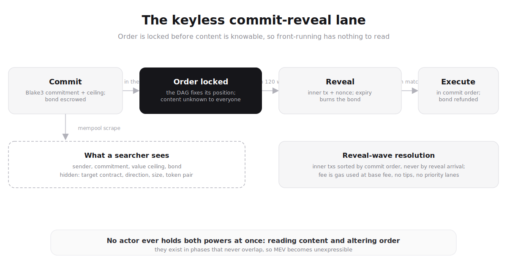

# Chapter 9: MEV Protection

Maximal Extractable Value is the single largest structural problem in
production blockchain design. On Ethereum it transfers somewhere between
$1B and $3B annually from ordinary users into the pockets of searchers,
builders, and validators. On Solana the Jito stack is a tip auction by
another name. Every "fix" attempted at the application layer ultimately
relies on someone who can see your transaction before it lands.

Pyde does not mitigate MEV. It removes the mechanism by which it is
expressible. This chapter walks through the four interlocking pieces that
make front-running, sandwich attacks, JIT liquidity sniping, and ordering
bribery infeasible at the protocol level: not in policy, in physics.

**Post-pivot context.** The earlier HotStuff design had a single proposer
per slot, which was both the source of and the brake on MEV. After the
2026 pivot to Mysticeti DAG consensus, there is **no single proposer**
to bribe or collude with: each round, every committee member produces a
vertex independently, and the canonical order is derived from a
deterministically-selected anchor + commit certificate. This makes the
MEV story even stronger: the DAG fixes transaction order *before* anyone
can read transaction content.

**Privacy is opt-in per transaction.** Users who don't care about
front-running (e.g., simple transfers, public DAO votes) submit plaintext
transactions directly for lower fees and lower latency. Users who do care
(swaps, liquidations, arbs) route through the **private mempool**: a
keyless commit-reveal lane that hides content behind a Blake3 commitment
until the DAG has already fixed the order. The protocol supports both.

**Keyless by design.** The private mempool holds **no** decryption key.
There is no committee threshold key, no Kyber/ML-KEM ciphertext, no Shamir
shares, no DKG, no decryption ceremony. Safety never depends on any
quorum of validators declining to collude; it is unconditionally
trustless. The only cryptography involved is Blake3 hashing and FALCON
signatures, both post-quantum. (A one-shot *ciphertext* private mempool,
"Threshold-LWE", remains a v2+ research direction, documented in
[Chapter 20](20-future-direction.md); it would be an optional lane
*alongside* commit-reveal, gated on a trustless PQ threshold-keygen
breakthrough. It is not how Pyde works today.)

---

## 9.1 The MEV Problem

### What MEV looks like

The simplest sandwich attack:

```
Without MEV protection (Ethereum, Solana):

  Mempool:
    Alice: Buy 10,000 TOKEN_X at market

  Searcher sees Alice's tx and bundles:
    Searcher: Buy 5,000 TOKEN_X    <- inserted BEFORE Alice
    Alice:    Buy 10,000 TOKEN_X   <- executes at higher price
    Searcher: Sell 5,000 TOKEN_X   <- inserted AFTER Alice, profits

  Result:
    Alice pays a worse price.
    Searcher pockets the slippage.
    Builder/validator extracts a cut via tip or block-bid.
```

Variants: front-running (just the "Buy before"), back-running (capture an
arb the victim's swap creates), JIT liquidity (provide liquidity right
before a large swap, withdraw immediately after), liquidation sniping
(race other liquidators for a discount).

### Why mitigation isn't enough

Every "mitigation" approach in production today shares one defect: at least
one party (a builder, a relay, a private-mempool operator) can see your
transaction before its position in the block is final.

| Approach            | Who still sees the tx                        |
| ------------------- | -------------------------------------------- |
| PBS / MEV-Boost     | Builders + relays                            |
| Fair ordering       | Network observers (latency-exploitable)      |
| Batch auctions      | Solver (and only fixes one tx type: swaps)   |
| Custodial priv pool | Operator still sees                          |
| Naive commit-reveal | Order not fixed at commit time, so reorderable |

The common thread: as long as anyone can read your transaction *before*
its position is final, MEV extraction is possible. Naive commit-reveal
schemes fail because the ordering is chosen *after* reveal: the party who
orders reveals can still reorder them.

Pyde's choice closes the gap the other way around: fix the order
*deterministically at commit time*, before any content is knowable, so
that when content is finally revealed there is nothing left to reorder.

---

## 9.2 The Four Layers

```
Layer 1: PRIVATE MEMPOOL (KEYLESS COMMIT-REVEAL)
    - To use the MEV-protected lane, a user submits a Commit tx carrying
      only a Blake3 commitment to the real ("inner") transaction, plus a
      value_ceiling and an escrowed bond.
    - The inner tx content — to, value, calldata, tx_type — is hidden by
      the commitment hash. No key exists that could decrypt it; the only
      way to learn it is for the committer (or anyone) to later reveal it.
    - Opt-in per tx: transactions that don't need MEV protection skip the
      lane and execute in plaintext at lower cost and latency.
    - Closes (for private txs): front-running, sandwich, JIT,
      liquidation-sniping based on reading mempool contents.

Layer 2: DAG COMMIT-BEFORE-REVEAL ORDERING
    - The DAG fixes the canonical order of Commit txs deterministically at
      COMMIT TIME, via the committed subdag — before any content is known.
    - In the reveal wave's resolution pass, revealed inner transactions
      execute IN COMMIT ORDER (the DAG-sequenced order of the commits),
      NOT reveal order.
    - Closes: post-reveal reordering. Order is locked before content is
      readable, so there is nothing to reorder once content appears.

Layer 3: STRUCTURAL INCLUSION (DAG)
    - Every vertex from round R includes references to >= 85 parent
      vertices from round R-1. A tx introduced into the DAG via any
      honest member's batch is committed once any committed anchor
      references the path containing it.
    - There is no "proposer" who can selectively omit. Censorship
      requires >= 44 validators (the equivocation threshold) to refuse
      to reference the tx — a structurally visible attack.
    - Closes: single-actor censorship of pending txs (commits and reveals).

Layer 4: NO TIPS, NO PRIORITY FEES
    - The wire format has no field for a tip, priority fee, or out-of-band
      payment to any party.
    - The fee is exactly gas_used * base_fee.
    - Closes: bribery channels for ordering.
```

Each layer closes attacks the others alone could not. Removing any one
re-opens a class of MEV. Note that Layers 1 and 2 are the crux: content is
hidden until *after* the DAG has committed the order, so the two
capabilities MEV requires (reading content and choosing position) never
coexist in any actor at any moment.

---

## 9.3 Layer 1: The Private Mempool (Keyless Commit-Reveal)

The private mempool is a two-phase lane. A user first publishes a
**Commit** that binds them to a hidden inner transaction; later, a
**Reveal** discloses that inner transaction for execution. Because the
commitment is a Blake3 hash, not a ciphertext, there is no key anywhere
in the system that could decrypt it. The content is unreadable until the
reveal, full stop.

### The commitment

```
commitment = Blake3( "pyde-commit-reveal-v1" || borsh(inner_tx) || nonce )
```

`inner_tx` is the real transaction the user wants executed (its full
`to` / `value` / `calldata` / `tx_type`). `nonce` is a fresh 32-byte
random value that blinds the commitment so the hash cannot be brute-forced
for low-entropy inner txs. The domain-separation tag
`"pyde-commit-reveal-v1"` prevents the commitment from ever being
reinterpreted as another kind of hash.

### The two transaction types

**Commit: `TxType 0x11`**

```
to     = ZERO address
value  = required_bond          (escrowed on inclusion)
data   = borsh(CommitPayload {
             commitment:    [u8; 32],
             value_ceiling: Balance,   // upper bound on inner-tx value
         })
```

**Reveal: `TxType 0x12`**

```
to     = ZERO address
value  = 0
data   = borsh(RevealPayload {
             commitment: [u8; 32],
             nonce:      [u8; 32],
             inner_tx:   Vec<u8>,      // borsh-encoded inner transaction
         })
```

On receipt of a Reveal, any node recomputes
`Blake3("pyde-commit-reveal-v1" || inner_tx || nonce)` and checks it
equals the `commitment` of a previously-committed, still-open Commit. If
it matches, the inner transaction is scheduled for execution at that
commit's fixed order.

**Anyone may reveal.** The Reveal need not come from the committer: its
validity is purely the hash match, not the sender. This matters for
liveness: if the committer goes offline after committing, any party
(including an altruistic relay or the counterparty) can still push the
reveal in before the window closes, saving the committer's bond and
landing their transaction.

### Bond economics

The Commit escrows a bond sized to the transaction's declared value
ceiling:

```
required_bond(value_ceiling) = max( MIN_COMMIT_BOND,  value_ceiling * 1% )

  MIN_COMMIT_BOND = 1e9 quanta = 1 PYDE
```

- **Refunded** in full when the Reveal is accepted within the window.
- **Burned** on abandonment (if the commit expires with no valid reveal).

The bond makes commit-spam economically pointless: a flood of commits that
are never revealed simply burns the attacker's PYDE. The 1% ceiling ties
the anti-spam cost to the value the transaction is trying to protect,
without over-charging small transfers (which pay the 1 PYDE floor).

### The reveal window

```
COMMIT_REVEAL_WINDOW_WAVES = 120
```

The Reveal must land within **120 waves** of the Commit's inclusion wave.
If no valid reveal arrives in that window, the commit **expires**: the
inner transaction never executes and the bond is forfeit (burned). The
window is a view predicate: every node independently computes expiry from
the commit's inclusion wave, so there is no ambiguity about whether a late
reveal is still valid.

### What a searcher sees in the private mempool

```
Pyde private mempool (what an observer scrapes):

  tx_hash | sender | type   | commitment | value_ceiling | bond
  --------+--------+--------+------------+---------------+--------
  0xabc...| Alice  | Commit | 0x8f3a...  | 2,000 PYDE    | 20 PYDE
  0xdef...| Bob    | Commit | 0x2c7b...  | 50 PYDE       | 1 PYDE
  0x123...| Carol  | Commit | 0x91de...  | 5,000 PYDE    | 50 PYDE
```

The observer learns *who* committed, an *upper bound* on the value each is
moving (`value_ceiling`), and the bond. They learn **nothing** about the
target contract, the swap direction, the size, the token pair, or the
slippage tolerance: those live inside `inner_tx`, behind the Blake3
commitment. There is no attack bundle to construct, because there is no
readable intent to attack.

### Anti-spam and per-sender rate limits

Beyond the bond, the mempool applies the same per-sender limits that apply
to all transaction types:

| Limit                                 | Default       | Why                              |
| ------------------------------------- | ------------- | -------------------------------- |
| `DEFAULT_MAX_TX_PER_WINDOW_PER_SENDER`| 10 tx / 1 s   | Token-bucket burst limit         |
| `DEFAULT_MAX_CONCURRENT_PER_SENDER`   | 100 in pool   | Cap concurrent pending txs       |
| `RATE_WINDOW_MS`                      | 1000 ms       | Token-bucket window size         |

Each sender has a `SenderQuota` tracking a timestamp deque + concurrent
count; an `add()` past the limit returns `MempoolError::RateLimited`. The
Commit is a normal signed transaction: its FALCON signature binds it to
exactly one sender, so rate limits and bond attribution are unambiguous.

---

## 9.4 Layer 2: DAG Commit-Before-Reveal Ordering

This is the mechanism that actually defeats MEV. In the post-pivot DAG
architecture, ordering and revelation are **structurally** separated in
time, and, crucially, ordering happens *first*.

1. **Commit wave.** A `Commit` (0x11) lands in the DAG like any other
   transaction. The committed subdag traversal assigns it a **canonical
   position** among all transactions in that wave. That position is now
   fixed: a deterministic function of vertices already in the DAG. At
   this moment nobody, including validators, knows what the inner
   transaction does; they only hold its Blake3 commitment.

2. **Reveal wave (any wave within the next 120).** A `Reveal` (0x12)
   lands, disclosing `inner_tx` + `nonce`. Nodes verify the hash match
   against the open commit.

3. **Resolution pass.** In the reveal wave's resolution pass, all inner
   transactions whose reveals have arrived are executed **in commit
   order** (the DAG-sequenced order of their original *commits*), not in
   the order the reveals happened to arrive. Reveal arrival order is
   irrelevant; it cannot change execution order.

```
Commit wave W    : Commit_A, Commit_B, Commit_C land
                   -> DAG fixes order: A < B < C  (content unknown)
Waves W+1..W+120 : Reveals arrive in ANY order, e.g. Reveal_C, Reveal_A, Reveal_B
Reveal resolution: inner_A, inner_B, inner_C execute in COMMIT order A < B < C
```

The critical property: **the order is fixed at commit time, before any
content is knowable.** An adversary commits blind: they cannot see the
content of Alice's commit, and their own position relative to hers was
locked the instant both commits entered the DAG. By the time content is
revealed, every position is already immutable. There is no actor who ever
holds both the ability to read content AND the ability to alter ordering;
those capabilities exist in non-overlapping phases.

### Why this is stronger than naive commit-reveal

Ordinary commit-reveal schemes let whoever sequences the *reveals* pick
their order, reintroducing exactly the reordering power they were meant
to remove. Pyde does not order reveals at all. It orders **commits**, at
commit time, via the DAG, and then binds each reveal back to its commit's
frozen position. You don't trust any sequencer, because the sequence was
determined by the DAG before contents could be read. No commitment
signature or reveal-ordering rule is needed: the commit order *is* the
DAG order.

### Implementation

The canonical subdag traversal and ordering emission live in
`crates/consensus/src/subdag.rs`. The commit-reveal resolution pass (hash
verification, window/expiry checks, bond settlement, and in-commit-order
scheduling) lives in `crates/mempool/src/commit_reveal.rs` and
`crates/consensus/src/wave.rs`.

---

## 9.5 Layer 3: Structural Inclusion (DAG)

Under HotStuff, a single proposer could selectively omit txs, motivating
the local-view mandatory-inclusion check. Under Mysticeti DAG, there is
**no single proposer**: every committee member produces a vertex each
round, each vertex references batches from any worker the producer
gossiped with, and every committed wave traverses the entire subdag.

For a transaction to be censored, **a coalition of ≥ 44 validators**
(equivocation threshold = `n - 2f = 128 - 84 = 44`) must all refuse to
reference the batch containing it. Below that threshold, ≥ 85 honest
vertices reference it and it lands in some committed subdag. This applies
equally to Commits and Reveals: an adversary cannot censor a reveal to
force a victim's bond to expire without a coalition-scale, visible attack.

```
A tx (Commit or Reveal) submitted to ANY honest worker is gossiped to all
128 validators. Each validator's primary produces a vertex referencing
batches from workers it received from. As long as 85+ committee members
eventually reference the batch (directly or transitively via the parent
links), the tx is committed in the next wave.

Censoring requires 44+ validators to coordinate omission — a structurally
visible attack with multiple independent forks of evidence.
```

### Mempool-level mandatory inclusion (residual)

For tighter guarantees on a per-vertex basis, a validator can still skip
or down-weight a vertex that omits txs visible in its local mempool view
for >= grace_slots. This is **defensive**, not necessary for safety;
the DAG already guarantees inclusion at the wave level. The check
catches single-validator censorship attempts before they require coalition.

The audit logic lives in `crates/mempool/src/inclusion.rs`.

### Cryptographic mempool commitments (post-mainnet)

Cryptographically aggregated mempool commitments (every committee member
periodically gossips a hash-set of txs they've seen, then the DAG-level
inclusion check is against the union) make censorship coalition-bounded
even at the round level. This is tracked for post-mainnet hardening; not
needed for safety at launch.

---

## 9.6 Layer 4: No Tips, No Priority Fees

Pyde's gas model has no field anywhere in the wire format for a "priority
fee" or "tip." Every transaction pays exactly:

```
fee = gas_used * base_fee
```

Where `base_fee` is algorithmically determined by EIP-1559 (target 400M gas,
4× elastic ceiling, ±12.5% per wave adjustment). The only sender-controlled
fee parameter is `gas_limit`, which is a cap (refunded if execution uses
less).

### Why this matters

Even if the private mempool + commit-order-lock + mandatory inclusion
fully closed the direct ordering attacks, a tip would re-open the bribery
channel. A searcher could pay a committee validator out-of-protocol to
delay a tx, to position their own tx first, or to censor a competitor's
tx. Tips create the economic incentive for all of those attacks; absent
tips, no validator gains anything from any of them.

### How ordering happens

Under the DAG, ordering is a deterministic function of the committed
subdag, not a proposer choice. The subdag traversal at each commit
emits transactions in a canonical order derived from vertex round, member
id, and batch sequence. No actor (proposer, validator, observer)
chooses positions.

For sequential nonce dependencies (a sender submitting txs `n`, `n+1`, `n+2`
in quick succession), the protocol uses the 16-slot bitmap nonce window
(see Chapter 11): the txs can be included in any order within the window;
gaps are tolerated.

---

## 9.7 The End-to-End Walkthrough



*The commit-reveal lane: the DAG fixes a commitment's position before anyone can read its content, so revealed transactions execute in an order no one could have gamed.*

A swap from Alice's wallet through the full private-mempool pipeline:

```
Step 1 — WALLET (Alice) : BUILD + COMMIT
  - Build inner tx: to=DEX, calldata=swap(USDC, PYDE, 1000, min_out=950)
  - Draw a fresh 32-byte nonce
  - commitment = Blake3("pyde-commit-reveal-v1" || borsh(inner_tx) || nonce)
  - value_ceiling = 2,000 PYDE  (upper bound on the swap's value)
  - required_bond = max(1 PYDE, 2,000 PYDE * 1%) = 20 PYDE
  - Build Commit (0x11): to=ZERO, value=20 PYDE,
      data=borsh(CommitPayload{ commitment, value_ceiling })
  - Sign with Alice's FALCON-512 secret key; submit via pyde_sendRawTransaction

  Visible to anyone who scrapes the mempool:
    Alice sent a Commit. commitment=0x8f3a..., value_ceiling <= 2,000 PYDE,
    bond 20 PYDE, FALCON signature.
  Hidden:
    Target contract, direction (buy/sell), size, token pair, slippage.

Step 2 — INGRESS VALIDATION (any RPC node)
  - chain_id, FALCON sig, nonce window, gas-tank balance, gas ceiling,
    bond >= required_bond(value_ceiling), tx size -> all pass
  - Forward to a nearby worker; worker batches and gossips

Step 3 — COMMIT WAVE: DAG ORDER-LOCK (round R -> commit ~500 ms)
  - Alice's Commit lands in the DAG alongside other commits.
  - Anchor commit at round R+3 fires; canonical subdag traversal assigns
    Alice's Commit a FIXED position among this wave's transactions.
  - The bond is escrowed. Order is now locked — content still unknown to
    everyone, including validators.

Step 4 — REVEAL (within COMMIT_REVEAL_WINDOW_WAVES = 120 waves)
  - Alice (or any party) submits Reveal (0x12): to=ZERO, value=0,
      data=borsh(RevealPayload{ commitment, nonce, inner_tx })
  - Nodes recompute Blake3("pyde-commit-reveal-v1" || inner_tx || nonce)
    and match it against Alice's open commit. Match -> inner tx scheduled
    at the commit's fixed position.
  - If no valid reveal lands within 120 waves, the commit expires and the
    20 PYDE bond is burned; the swap never executes.

Step 5 — REVEAL-WAVE RESOLUTION: IN-COMMIT-ORDER EXECUTION
  - All inner txs whose reveals have arrived are sorted by their COMMIT
    order (not reveal arrival order), then handed to execution.
  - Alice's bond is refunded on acceptance of her reveal.

Step 6 — EXECUTION (Block-STM)
  - Prefetch the union of the revealed inner txs' access lists in one
    batched state_cf.multi_get (PIP-3) into the dashmap (PIP-4). Lists are
    hints; they never partition the wave or affect correctness.
  - Run every revealed inner tx in parallel via the Block-STM scheduler:
    optimistic execute through an MVCC layer + validate against
    canonical tx_index (commit) order + cascade-invalidate + re-incarnate
    on conflict + fixpoint. Full algorithm in
    companion/BLOCK_STM_EXECUTION.md.
  - Final state derived from the fixpoint: highest-tx_index's last
    write per slot. Execute against pre_state_root → new post_state_root.
  - Distribute fees: 70% burn, 20% to current epoch's reward pool, 10% treasury.
    (Layer 4: no tip is paid because no tip field exists in the wire format.)

Step 7 — STATE ROOT ATTESTATION
  - Each committee member FALCON-signs (wave_id, blake3_state_root, poseidon2_state_root).
  - Sigs piggyback on subsequent vertices.
  - ≥ 85 sigs -> finality.

Step 8 — RECEIPT
  - Receipt available via pyde_getTransactionReceipt for the revealed
    inner tx: success, gas_used, logs, fee_paid, fee_payer, wave_id
```

At no point in this flow does any party know Alice's transaction contents
AND have the ability to influence its ordering. The order was fixed at
commit time (Step 3), before content was knowable (Step 4). That
conjunction is what MEV requires; the protocol structurally denies it.

---

## 9.8 What Each Attack Vector Requires (And Why It Fails)

```
Front-running Alice's swap requires:
  1. Know Alice's intent               <- blocked: content hidden by Blake3 commitment (Layer 1)
  2. Insert before Alice in the order  <- blocked: order locked at COMMIT time, before content (Layer 2)
  3. Get into the wave at all          <- blocked by structural DAG inclusion (Layer 3)
  4. Have economic motive to bribe     <- blocked by no-tip rule (Layer 4)

Sandwich attack requires:
  1. Know the swap direction           <- (1) above
  2. Insert before AND after           <- (2): both positions fixed before reveal
  3. Bribe for specific positioning    <- (4) above

Censoring a competitor's commit/reveal requires:
  - Selectively omitting it            <- blocked by structural inclusion (Layer 3)

Bribing a committee validator for ordering requires:
  - A protocol mechanism to pay them    <- doesn't exist (Layer 4)
```

Each attack requires a conjunction of capabilities. Pyde structurally
denies at least one element of every conjunction, and for the core
front-running/sandwich attacks, it denies the very first one: you cannot
read what you cannot decrypt, and there is no key.

---

## 9.9 Edge Cases

### Reveal never arrives (commit expiry)

If no valid reveal lands within `COMMIT_REVEAL_WINDOW_WAVES = 120` waves of
the commit's inclusion wave, the commit expires. The inner transaction
never executes and the bond is **burned**. Because any party may submit
the reveal, expiry generally requires that the committer *and* every party
who could benefit from the reveal all stay silent (an unusual, and
self-punishing, outcome). The window is a pure view predicate: every node
computes it identically from the commit's inclusion wave, so there is no
disagreement about whether a late reveal is valid.

### Reveal that doesn't match its commit

A Reveal whose `Blake3("pyde-commit-reveal-v1" || inner_tx || nonce)` does
not equal any open commitment is simply invalid: it matches nothing and
schedules nothing. It cannot bind to someone else's commit (the hash won't
match) and cannot replay an already-resolved commit (the commit is closed).
An invalid reveal wastes the submitter's gas and does nothing else.

### Malformed / junk inner transaction

A user could commit to an inner tx that reveals correctly (the hash
matches) but is itself malformed: a bad signature, a nonce out of window,
or calldata that reverts. The reveal is accepted (hash matched, so the
bond is refunded), but the inner tx then fails normal execution
validation: it consumes gas and reverts, exactly as any malformed
plaintext tx would. There is no way to hide a valid-looking reveal that
executes to something *other* than the committed bytes: the commitment
binds the exact `inner_tx` byte string.

### Grinding the commitment

Because `nonce` is a fresh 32 bytes of entropy, an observer cannot
brute-force the Blake3 commitment to recover a low-entropy inner tx (e.g.,
a swap with a small set of plausible parameters). The `value_ceiling`
leaks only an upper bound on the inner value, never the contract, the
direction, or the exact amount.

### Epoch boundary transitions

Commit-reveal state is ordinary chain state (open commits, their inclusion
waves, and escrowed bonds); it carries across epoch boundaries with the
rest of the ledger. There is **no** key material to reshare and **no**
threshold ceremony to coordinate across a committee rotation, because the
lane holds no key. A commit made just before an epoch boundary is revealed
and resolved by the new committee under exactly the same rules; the 120-wave
window is unaffected.

### One-shot ciphertext option (future)

A single-transaction *ciphertext* private mempool (where the user submits
one encrypted transaction instead of a commit/reveal pair) is a v2+
research direction ("Threshold-LWE") documented in
[Chapter 20](20-future-direction.md). It would require a trustless PQ
threshold-keygen breakthrough (lattice public keys do not combine
homomorphically the way BLS does), and would ship as an *optional* lane
alongside the keyless commit-reveal default, not a replacement for it.

---

## 9.10 Performance Cost

The private mempool trades one extra round-trip for MEV protection: a
protected transaction is a Commit followed by a Reveal, versus a single
plaintext transaction. There is **no** threshold-decryption pipeline, no
share gossip, and no combine step; those were removed with the threshold
lane.

| Step                        | Cost                    | Where it lives                            |
| --------------------------- | ----------------------- | ----------------------------------------- |
| Commit inclusion (DAG)      | ~500 ms median          | `crates/consensus/src/wave.rs`            |
| Commitment hash (Blake3)    | negligible (µs)         | `crates/mempool/src/commit_reveal.rs`     |
| Reveal inclusion (DAG)      | ~500 ms median          | `crates/consensus/src/wave.rs`            |
| Reveal hash-match + resolve | negligible per tx       | `crates/mempool/src/commit_reveal.rs`     |

A protected transaction reaches execution after its reveal wave commits:
roughly **two** DAG commits (commit wave + reveal wave) rather than one, so
on the order of ~1 s median vs ~500 ms for plaintext, depending on how
quickly the reveal is submitted after the commit is seen included. There is
no cryptographic serialization bottleneck: the only added work per tx is
two Blake3 hashes (commit + verify). Plaintext-only usage pays zero of this
overhead.

The wire cost is one extra transaction (the Reveal, carrying `inner_tx` +
32-byte `nonce`) per protected transaction, with no per-validator share
data on consensus vertices.

---

## 9.11 What's Visible vs Hidden: Recap

For a **plaintext** transaction, everything is visible. For a **private**
(commit-reveal) transaction, only the commit envelope is visible until the
reveal:

```
+-----------------------------+-----------+----------------+
| Field                       | Plaintext | Private (Commit)|
+-----------------------------+-----------+----------------+
| sender                      |    Y      |   Y            |
| nonce (account)             |    Y      |   Y            |
| gas_limit                   |    Y      |   Y            |
| commitment (Blake3)         |    -      |   Y            |
| value_ceiling (upper bound) |    -      |   Y            |
| bond                        |    -      |   Y            |
| signature                   |    Y      |   Y            |
| to (inner)                  |    Y      |   hidden        |
| value (inner)               |    Y      |   hidden (<= ceiling) |
| calldata (inner)            |    Y      |   hidden        |
| tx_type (inner)             |    Y      |   hidden        |
+-----------------------------+-----------+----------------+
```

For a private transaction you see *who* committed and an *upper bound* on
the value they're moving. You don't see *what* they're doing, to *which*
contract, or the *exact* amount until the reveal, by which point the
order is already fixed.

---

## 9.12 What This Doesn't Solve

Honest about the limits:

- **Value-ceiling leakage.** The `value_ceiling` in a Commit leaks an
  *upper bound* on the inner transaction's value (it must, to size the
  bond). A user moving a large amount reveals that they are moving *at
  most* that much, never the exact figure, the contract, or the
  direction. Wallets can round the ceiling up to a coarse bucket to blunt
  even this signal.

- **Out-of-protocol coordination.** If a user signs an off-chain message
  saying "I will swap soon," anyone with that information can act on it. The
  protocol can't prevent users from leaking their own intent.

- **Long-run statistical profiling.** A persistent attacker who correlates
  a sender's commit cadence and value ceilings over many transactions could
  infer coarse behavior. This is a privacy concern, not an MEV one: the
  individual transactions are still safe from front-running, since content
  and order are both settled before content is knowable.

- **Searcher-on-searcher games at the DEX/contract level.** If a contract
  has a built-in tip mechanism (priority gas auctions inside the contract
  itself), Pyde's protocol-level MEV protection doesn't reach into it.

For mainnet, the in-scope guarantees are: no front-running by any party
(there is no key to decrypt content early), no sandwich attacks composable
through the mempool, no censorship of pending commits or reveals below the
coalition threshold, and no bribery channel for ordering.

---

## Summary

Pyde's MEV protection is not a feature bolted on to an otherwise standard
chain. It is a structural property of the protocol arising from the
interaction of four mechanisms:

| Layer                            | Closes                                          | Lives in                                |
| -------------------------------- | ----------------------------------------------- | --------------------------------------- |
| Private mempool (commit-reveal)  | Reading tx contents pre-inclusion (opt-in)      | `crates/mempool/src/commit_reveal.rs`   |
| DAG commit-before-reveal order   | Reordering after reveal (order locked at commit)| `crates/consensus/src/wave.rs`          |
| Structural inclusion (DAG)       | Single-actor censorship                         | `crates/consensus/src/dag.rs`           |
| No tips / priority fees          | Bribery for ordering                            | `crates/tx/src/fee.rs`                  |

The whole scheme is **keyless and unconditionally trustless**: no committee
holds a decryption key, so safety never rests on any quorum declining to
collude. The only cryptography is Blake3 hashing and FALCON signatures,
both post-quantum. Content is hidden until *after* the DAG has fixed the
order, so the two capabilities MEV requires (reading content and choosing
position) never coexist in any actor. MEV extraction is not
"discouraged"; it is unexpressible in the protocol.

**v1 scope.** The keyless commit-reveal private mempool is the permanent
MEV-protection mechanism. Local-view mandatory inclusion is implemented and
safe (a defensive backstop on top of structural DAG inclusion).
Cryptographically aggregated mempool commitments + on-chain censorship
slashing are tracked as post-mainnet hardening. A one-shot *ciphertext*
private mempool (Threshold-LWE) remains v2+ research
(see [Chapter 20](20-future-direction.md)) and would be an optional lane
alongside commit-reveal, not a replacement.

The next chapter covers the gas and fee model that the no-tip rule sits on
top of.
