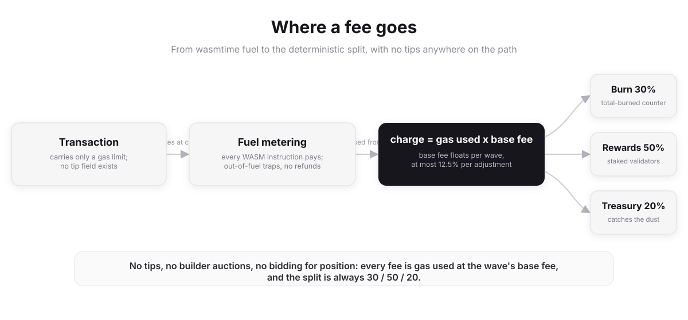

# Chapter 10: Gas and Fee Model



*A fee's full path: wasmtime fuel meters execution, the per-wave base fee prices it, and every fee splits 30/50/20 across burn, rewards, and treasury.*

Pyde meters every operation in **gas**. The economic model on top of gas is
EIP-1559 with 4× elastic waves, deterministic 30/50/20 fee distribution,
and no priority fees. There is no tip field, no builder/proposer separation,
no bidding war for inclusion order.

This chapter covers the full model: gas costs per opcode, the EIP-1559 base
fee math, elastic wave sizing, the 30/50/20 split, sponsored transactions
through gas tanks, and the calldata/tx size limits.

---

## 10.1 Gas Accounting

Pyde uses wasmtime's **fuel** mechanism for gas metering. At node startup, the engine establishes a deterministic mapping from gas units (the chain-level metering unit) to wasmtime fuel units. Every WebAssembly instruction consumes a configurable amount of fuel; host function calls also consume fuel manually, charged by the host based on operation cost (`sstore` is heavier than `add`, for example).

When fuel reaches zero, wasmtime traps the execution with an out-of-fuel error. The transaction reverts; the sender pays gas for all the work done up to the trap point. There is no refund.

```rust
struct ExecContext {
    gas_limit: u64,    // set by the transaction
    gas_used:  u64,    // computed from fuel consumed during execution
}
```

### Charging model: validate up front, deduct after execution

```text
Step 1 — Ingress validation (at RPC):
  Check sender.balance ≥ gas_limit × base_fee + value_attached.
  If insufficient: REJECT before mempool admission.

Step 2 — Mempool admission + propagation:
  No balance changes. Tx flows through workers, batches, vertices.

Step 3 — Execution (at wave commit):
  Re-check balance (sender may have spent in prior txs of this wave).
  Execute via wasmtime, tracking consumed_fuel.
  On completion (success OR trap):
    gas_used   = fuel_to_gas(consumed_fuel)
    charge     = gas_used × base_fee
    sender.balance -= charge + (value_attached if execution succeeded)
    
Step 4 — Fee distribution (always 30/50/20):
    burn        += charge × 0.30
    reward_pool += charge × 0.50
    treasury    += charge × 0.20
```

### No gas refunds in v1

Pyde v1 ships with **zero gas refunds**. `gas_used` is what the user pays, always. The `sdelete` host function is a regular metered operation; it has a lower gas cost than `sstore` (clearing a slot is less work than writing), but there is no refund applied on top.

The reasoning:

1. **Ethereum had to roll back gas refunds via EIP-3529** after gas-token attacks (CHI, GST2) abused refunds to manipulate gas markets at scale. The refund mechanism turned out to be an attack surface, not a feature.

2. **Pyde handles state cleanup at the engine layer** via PIP-4's write-back cache + state pruning policy, not via user incentives. Storage doesn't accumulate unbounded regardless of whether users explicitly delete. The financial incentive is unnecessary.

3. **Simpler accounting.** No refund-capping rules, no two-step charge-then-refund logic, no edge cases.
   Receipts carry one number, `gas_used`, and that's the charge.

### Why fuel, not opcode counting

Fuel is built into wasmtime's Cranelift backend. Every basic block is instrumented to decrement a fuel counter; when the counter goes negative, execution traps. The instrumentation is efficient enough not to dominate execution time.

Implementing custom opcode-counting on top of wasmtime would be slower and add maintenance burden for no functional gain. The chain-side gas table maps WASM instruction categories and individual host functions to fuel costs; the engine consumes that table at startup and configures wasmtime accordingly.

### Why a single dimension

Earlier drafts of this book described a two-dimensional gas model
(`exec_cost + prove_cost`) intended to price both CPU work and ZK proving
work separately. With ZK proving deferred to post-mainnet, the
proving-cost dimension does not exist at launch and the two-dimensional
model collapses into a single number: the chain-level gas total derived
from wasmtime fuel consumption.

Should ZK proving land later, the second dimension can be re-introduced as a separate counter without changing the wire format (transactions already carry only `gas_limit`).

---

## 10.2 EIP-1559 Base Fee

Pyde's base fee adjusts every wave by up to 12.5% in either direction
based on whether the previous wave exceeded or fell below the gas target.

### Constants (`crates/tx/src/fee.rs`)

| Constant              | Value                          | Meaning                            |
| --------------------- | ------------------------------ | ---------------------------------- |
| `GAS_TARGET`          | 400,000,000                    | 50% of the elastic ceiling         |
| `GAS_CEILING`         | 1,600,000,000                  | 4× target; hard wave ceiling       |
| `base_fee_start`      | 100 quanta/gas (default)       | Initial value at genesis — a **genesis-manifest field** in `crates/types/src/genesis.rs`, not a code constant. The old `GENESIS_BASE_FEE = 50_000_000_000` constant was a stale orphan and has been deleted. |
| `MIN_BASE_FEE`        | 1                              | Floor; cannot drop to zero         |
| `ADJUSTMENT_DIVISOR`  | 8                              | 1/8 = 12.5% max change per wave    |

### Adjustment formula

```rust
fn adjust_base_fee(parent_base_fee: u128, parent_gas_used: u64) -> u128 {
    if parent_gas_used == GAS_TARGET {
        parent_base_fee
    } else if parent_gas_used > GAS_TARGET {
        let delta = parent_gas_used - GAS_TARGET;
        let bump  = parent_base_fee * delta as u128 / GAS_TARGET as u128 / 8;
        parent_base_fee + bump.max(1)
    } else {
        let delta = GAS_TARGET - parent_gas_used;
        let drop  = parent_base_fee * delta as u128 / GAS_TARGET as u128 / 8;
        (parent_base_fee.saturating_sub(drop)).max(MIN_BASE_FEE)
    }
}
```

Properties:

- **Proportional adjustment.** The change scales with how far the wave
  deviated from target. A wave at 75% target produces a smaller bump than
  one at 100% target.
- **Capped at ±12.5% per wave.** No oracle, no governance vote.
- **Bounded below by `MIN_BASE_FEE`.** Cannot reach zero.
- **Minimum increase of 1 quanta.** Even at very low fees, a busy wave
  bumps the fee at least one quanta.

### Convergence at ~500 ms commits

Mysticeti DAG produces a commit every ~500 ms median (Chapter 6).
Each wave is the unit at which the base fee is recomputed. The DAG commits at
per-wave granularity, so "wave" and "commit" name the same boundary. Pyde has
no block: wherever another chain would say "block", Pyde means the wave.

| Scenario                    | Time to 2× the fee         |
| --------------------------- | -------------------------- |
| Sustained 100% full commits  | ~11 commits (~5.5 s)       |
| Sustained 4× full (max)      | ~6 commits (~3 s)          |
| Sustained empty             | half-life ~5 commits (~2.5 s) |

Equilibrium under fluctuating demand sits around 50% of the gas target.

---

## 10.3 Elastic Waves

Pyde waves have two gas limits:

| Limit             | Value (gas)        | Role                                  |
| ----------------- | ------------------ | ------------------------------------- |
| Target            | 400,000,000        | "Normal" wave fullness                |
| Hard ceiling (4×) | 1,600,000,000      | Cannot exceed even under congestion   |

A single wave can carry up to `4 × GAS_TARGET = 1.6B` gas. When a wave exceeds
the target, the base fee for the next wave rises proportionally.

```
Gas usage during a congestion spike:

   4× ┤ ......................... hard ceiling
      │
   3× ┤            +-+
      │           /   \
   2× ┤      +---+     +---+
      │     /               \
target┤----+                 +---+----  target line
      │   /                       \
   1× ┤  /                         +-...
      │
      +---------------------------------------> waves
                spike      decay
        base fee rises ~2x         then settles
```

### Why 4× and not higher

- **Validator memory.** A 4× wave has up to 4× more transactions to buffer
  and execute. The per-validator memory ceiling caps how high this
  can safely go on commodity hardware.
- **Reveal-resolution + voting timing.** A 4× wave's commit-reveal mempool
  reveal-resolution pass (re-executing revealed inner transactions in
  deterministic commit order) takes longer; the commit timing budget
  assumes the worst case fits.
- **State growth.** Larger waves drive faster state growth. The 4× ceiling
  bounds worst-case growth by the same factor.

### Gas-bound throughput ceiling

At 2 commits/sec (~500 ms commit), `GAS_TARGET = 400M`, `GAS_CEILING = 1.6B`:

| Workload                | Gas/tx  | Relative gas-bound ceiling | Realistic v1 (committee-bound) |
| ----------------------- | ------- | -------------------------- | ------------------------------ |
| Simple transfer         | 21,000  | Highest                    | awaiting harness |
| Token transfer (pts-f/1)| 65,000  | Moderate                   | awaiting harness |
| DEX swap                | 200,000 | Lowest                     | awaiting harness |

**Honest v1 numbers.** The gas-bound ceiling above is a mechanical cap
(wave gas budget ÷ gas-per-tx), assuming committee hardware fully
saturates execution. In practice, the v1 honest throughput
target (to be established by the multi-region performance harness) is set on
commodity committee hardware (500 Mbps NIC, 32-core, 64 GB). Higher numbers
require larger NICs and more cores; see Chapter 19 for the launch-strategy
capacity table.

Real numbers depend on workload composition. The performance harness
([companion/PERFORMANCE_HARNESS.md](../companion/PERFORMANCE_HARNESS.md))
is the only valid source of TPS claims: publish only what the harness
measures under sustained, production-realistic conditions, never lab
extrapolations or microbenchmark peaks. The headline
number is never the theoretical max.

---

## 10.4 No Tips, No Priority Fees

Pyde's transaction format has **no priority-fee field**. Every transaction
pays exactly:

```
fee = gas_used * base_fee
```

There is no bidding, no auction, no out-of-protocol payment to any
committee validator. The MEV-protection consequences are spelled out in
Chapter 9; the gas-economics consequences are:

- **Predictable fees.** Wallets can quote a single number, not a range.
- **No fee market gaming.** No need for fee-estimation oracles or
  multi-priority queues.
- **Simpler accounting.** The fee distribution is a single division, not a
  base-vs-tip split.

### How does ordering happen, then?

Under the Mysticeti DAG, ordering is a deterministic function of the
committed subdag: vertices are produced independently each round, the
anchor commit selects a canonical traversal, and transactions emerge in a
fixed canonical order. No actor chooses positions; the order is structural
(Chapters 6 and 9).

For sequential nonce dependencies, the protocol uses the 16-slot **nonce
bitmap window** (Chapter 11): a sender can submit txs `n`, `n+1`, `n+2`
out of order; gaps are tolerated up to the window size.

### Legitimate urgency

Use cases that need fast inclusion (liquidations, bridges, time-sensitive
trades) have two routes:

- **Pre-fund a paymaster's gas tank** (sponsored tx; see §10.7) so the
  user doesn't bottleneck on liquidity.
- **Use the deadline field** to expire stale txs that were not included
  quickly, freeing the nonce slot for a fresh attempt.

Neither route bribes anyone for ordering.

---

## 10.5 Fee Distribution: 30 / 50 / 20

Every fee splits deterministically:

| Recipient          | Share | Where it goes                                      |
| ------------------ | ----- | -------------------------------------------------- |
| **Burn**           | 30%   | Advances the on-chain `TOTAL_BURNED` counter        |
| **Reward pool**    | 50%   | Credited to the `pyde-reward-pool` system account; drained once per epoch as the validator wage (Chapter 14 §14.5) |
| **Treasury**       | 20%   | Credited to the treasury account (remainder, catches rounding dust) |

Note: in the pre-pivot HotStuff design the validator share went directly
to the slot proposer. Under the DAG there is no single proposer, so the
share accrues to a pool and pays the committee per epoch. See Chapter 14
for the wage math.

Implemented in `crates/tx/src/fee.rs`:

```rust
pub const BURN_BPS: u128        = 3_000;   // 30%
pub const REWARD_POOL_BPS: u128 = 5_000;   // 50%
// treasury = fee − burned − reward (remainder catches rounding)
```

The split is computed per transaction from the receipt's `fee_paid` and
applied once per wave by `apply_wave_fee_credits` in the shared serial
commit path, so every node (committer, replayer, state-sync, recovery)
derives identical credited state roots. The remainder-to-treasury pattern
catches rounding dust so no quanta are lost: burned + reward + treasury
equals fees paid, exactly.

### Why not 100% burn?

A 100% burn (Ethereum's EIP-1559 model for the base fee) would decouple
validator revenue from usage entirely and push the whole security budget
onto the emission tap. Pyde wants the opposite coupling: the 50%
reward-pool share means real usage funds the validator wage first, and
the shortfall mint (Chapter 14 §14.3) only tops up the gap. As fee volume
grows, fees retire the mint.

The 30% burn is the counterweight to that mint: it offsets issuance so
net supply hovers near genesis. It is a tunable garnish, retunable by
coordinated release, with a scale-down-with-volume policy so a large burn
never drains supply at high throughput. The 20% treasury share funds
protocol work via PIP-driven multisig spends (Chapter 15).

### Why no prover share?

Earlier drafts of this book carved a share out for provers. Without
provers at mainnet, that share folded into the treasury. If ZK proving
lands in a future hardfork, the split can be adjusted by coordinated
release; until then the treasury takes 20%.

---

## 10.6 Fee Calculation Examples

### Simple transfer (21,000 gas)

```
At the default base_fee_start = 100 quanta/gas:
  fee = 21,000 * 100
      = 2,100,000 quanta
      = 0.0021 PYDE

Distribution (30 / 50 / 20):
  Burn (30%):        630,000 quanta  (0.00063  PYDE)
  Reward pool (50%): 1,050,000 quanta  (0.00105  PYDE)
  Treasury (20%):    420,000 quanta  (0.00042  PYDE)
```

The unit is worth pausing on, because it is the easiest place to be off by
a factor of a billion. A quanta is already the smallest denomination —
`1 PYDE = 10^9 quanta` — so the Ethereum "50 gwei" mental model translates
to **~50 quanta/gas**, not 50,000,000,000. At the latter, a plain 21K-gas
transfer would cost 1.05 million PYDE.

### High-congestion scenario

If sustained demand has driven the base fee 3.5× higher:

```
base_fee = 350 quanta/gas
fee = 21,000 * 350 = 7,350,000 quanta = 0.00735 PYDE

Burn (30%):        2,205,000 quanta
Reward pool (50%): 3,675,000 quanta
Treasury (20%):    1,470,000 quanta
```

### Low-demand scenario

If sustained empty waves have driven the base fee to half normal:

```
base_fee = 50 quanta/gas
fee = 21,000 * 50 = 1,050,000 quanta = 0.00105 PYDE
```

The base fee keeps adjusting until the market clears: congestion makes it
expensive to spam, low usage makes inclusion cheap.

---

## 10.7 Sponsored Transactions

A user with no PYDE balance can still transact if a contract or paymaster
account pays the gas. Two mechanisms exist.

### Gas tanks

Every account has a `gas_tank: u128` field (see Chapter 4 / 11). It's a
balance separate from the account's spendable balance, dedicated to paying
gas on behalf of users.

```
Anyone can deposit to any account's gas tank:
  deposit_gas_tank(target, amount)

Only the account owner can withdraw:
  withdraw_gas_tank(target, amount, recipient)
```

To use a gas tank, a transaction sets:

```
tx.fee_payer = FeePayer::GasTank
```

The engine looks up the target contract's `gas_tank`, debits the fee from
there, and credits the receiver as usual. If the gas tank is empty, the tx
reverts (the sender did not pay).

### Paymaster pattern

For more complex sponsorship (eligibility checks, per-user limits), a
paymaster contract sits between the user and the target:

```
tx.fee_payer = FeePayer::Paymaster(paymaster_address)
```

The engine calls the paymaster's `validate_sponsorship(user, target,
calldata) -> bool` function (gas-bounded; see below). If it returns true,
gas is debited from the paymaster's gas tank.

```
+----------+      +------------------+     +-----------------+
|   User   |----->|   Paymaster      |---->|  Target         |
|  (no $)  |      |   - eligibility  |     |  Contract       |
+----------+      |   - rate limits  |     +-----------------+
                  |   - gas tank pays |
                  +------------------+
```

### Validation gas limit

To stop a paymaster from running an expensive validation function as a DoS
vector, the paymaster's `validate_sponsorship` has a hard gas cap of
**100,000 gas**. If validation exceeds that, the tx is rejected. This
prevents an adversarial paymaster from making mempool inclusion expensive
for relays.

### Use cases

| Use case            | Mechanism                                             |
| ------------------- | ----------------------------------------------------- |
| Free-to-play games  | Game contract's gas tank pays for player moves        |
| DeFi onboarding     | Protocol pays for first N swaps per user              |
| Corporate dApps     | Company paymaster covers employee transactions        |
| Airdrop claims      | Airdrop contract sponsors claim transactions          |
| Governance voting   | DAO pays gas for governance participation             |

---

## 10.8 Gas Costs for Common Operations

The full WASM-instruction and host-function gas table is published in the Host Function ABI specification. The headline numbers for the operations that dominate real-world gas usage:

### Storage

| Operation     | Host function | Gas       |
| ------------- | ------------- | --------- |
| Storage read  | `sload`       | 100 (warm)|
| Storage write | `sstore`      | 200 (warm)|
| Storage delete| `sdelete`     | 150 (no refund; cheaper than `sstore`) |

### Crypto

| Operation                  | Host function   | Gas                    |
| -------------------------- | --------------- | ---------------------- |
| Poseidon2 hash             | `poseidon2`     | 1,000 + 6 per 32B chunk|
| Blake3 hash                | `blake3`        | 100 + 1 per 32B chunk  |
| Keccak256 hash             | `keccak256`     | 200 + 3 per 32B chunk  |
| FALCON-512 verification    | `falcon_verify` | 20,000                 |
| Merkle path verification   | host fn         | 5,000                  |

### Cross-contract

| Operation              | Host function   | Gas                |
| ---------------------- | --------------- | ------------------ |
| External call          | `cross_call`    | 2,500 + callee work|
| Contract deployment    | system tx       | 32,000 + init code  |

### Events

| Operation     | Host function | Gas              |
| ------------- | ------------- | ---------------- |
| Emit event    | `emit_event`  | 375 + 8 per byte |

### WASM execution (per-instruction baseline)

| Category               | Fuel cost           |
| ---------------------- | ------------------- |
| Arithmetic instructions| 1-3 fuel per op    |
| Memory load/store      | 5 fuel per op       |
| Control flow           | 1-2 fuel per op     |
| Memory grow            | 200 fuel per 64KB page (first touch) |

The build-time state binding generator (see Chapter 5) emits efficient access patterns; for example, a single map lookup expands to one host-function call rather than multiple. The wasmtime-AOT pass then compiles the resulting WASM to native code for execution.

---

## 10.9 Validation Limits

The transaction validator
(`crates/tx/src/validation.rs`) enforces these limits at RPC ingress:

| Limit             | Value      | Constant                   |
| ----------------- | ---------- | -------------------------- |
| Min gas limit     | 21,000     | `MIN_GAS_LIMIT`            |
| Max gas per wave  | 1.6B       | `WAVE_GAS_MAX`             |
| Max tx size       | 128 KB     | `MAX_TX_SIZE`              |
| Max calldata size | 64 KB      | `MAX_CALLDATA`             |

`MAX_CALLDATA` is a separate cap from `MAX_TX_SIZE` (per the audit
recommendation, task 055 in the mainnet plan). The split prevents an
attacker from building a tx whose calldata fills the entire 128 KB tx
budget and starves the rest of the encoded fields.

A transaction that fails any of these checks is rejected at the RPC node
and never enters the mempool, so pollution is constrained to that single
ingress node.

---

## 10.10 Fee Estimation API

`pyde_estimateGas` runs the transaction in simulation against the current
state and returns the predicted gas consumption.

```json
> pyde_estimateGas
> {
>   "from":  "0xpyde1abc...",
>   "to":    "0xpyde1def...",
>   "data":  "0x...",
>   "value": "0x0"
> }
< {
<   "gas_estimate": 45200,
<   "base_fee":     "0x2D79883D2000",
<   "estimated_fee": "2260000000000000"
< }
```

Wallets typically multiply the estimate by ~1.10 to absorb state changes
between estimation and inclusion. Because base fee can move at most ±12.5%
per wave, the inclusion-time fee is bounded relative to the
estimation-time fee.

`pyde_call` runs read-only simulation without state mutation;
`pyde_createAccessList` produces the access list that should accompany the
transaction. Wallets typically chain these calls automatically:
`createAccessList` → `estimateGas` → submit signed tx with the resulting
access list.

---

## 10.11 Comparison

| Feature                  | Ethereum (EIP-1559)         | Pyde                              |
| ------------------------ | --------------------------- | --------------------------------- |
| Gas dimensions           | 1                           | 1                                 |
| Base fee mechanism       | Algorithmic (EIP-1559)      | Algorithmic (EIP-1559)            |
| Max base-fee change/unit | ±12.5% (per block)          | ±12.5% (per wave)                 |
| Priority fee / tip       | Yes                         | No                                |
| Elasticity               | 2× (15M target / 30M max)   | 4× (400M target / 1.6B max)       |
| Fee burn                 | 100% of base fee            | 30% of total fee                  |
| Validator share          | Tips only                   | 50% of total fee (no tip)         |
| Treasury share           | None                        | 20% of total fee                  |
| Native account abstraction| No (ERC-4337 add-on)       | Yes (gas tanks + paymaster)       |
| Storage rent             | None                        | None (gas pays for the SSTORE)    |
| MEV bribery resistance   | None (tip-based ordering)   | Structural (no tip; keyless commit-reveal mempool)|

---

## 10.12 Implementation Notes

### Integer arithmetic

All fee calculations use integer arithmetic to avoid floating-point
non-determinism. Quanta are `u128` (1 PYDE = 10^9 quanta; note this is
**not** Ethereum's 10^18 wei scale).

### Overflow protection

`compute_fee()` uses `checked_mul` to detect overflow. Realistic inputs
(`gas_used` in millions, `base_fee` in billions of quanta) fit comfortably
in `u128` (max product ≈ `2^60 * 2^40 = 2^100`, well below `2^128`). The
overflow check guards against pathological encodings.

### Base fee in the commit header

Pyde's commit header is the equivalent of Ethereum's block header
for fee-market purposes. Each commit carries the base fee for
transactions executed in that commit:

```rust
struct CommitHeader {
    // ...
    base_fee:    u128,     // base fee for txs in THIS commit
    gas_used:    u64,      // total gas consumed by this commit's txs
    gas_target:  u64,      // = GAS_TARGET (always 400M)
    gas_limit:   u64,      // = GAS_CEILING (always 1.6B)
}
```

(`pyde_getWave` returns a representation of this header. Pyde ships no
block-named RPC aliases.)

The base fee for wave `N+1` is computed from wave `N`'s header by
`adjust_base_fee()`, so every honest node arrives at the same value.

---

## Summary

| Property                  | Value                                           |
| ------------------------- | ----------------------------------------------- |
| Gas dimensions            | 1 (single counter)                              |
| Base fee mechanism        | EIP-1559, ±12.5% per wave adjustment            |
| Genesis base fee          | 100 quanta/gas (genesis-manifest default)        |
| Gas target                | 400,000,000 (50% of ceiling)                    |
| Gas ceiling               | 1,600,000,000 (4× target; elastic max)          |
| Priority fee / tip        | None                                             |
| Fee distribution          | 30% burn / 50% reward pool / 20% treasury       |
| Sponsored transactions    | Native (`gas_tank` field + paymaster pattern)   |
| Validation gas cap (paymaster)| 100,000                                      |
| Max tx size               | 128 KB (`MAX_TX_SIZE`)                           |
| Max calldata size         | 64 KB (`MAX_CALLDATA`)                           |
| Min gas limit             | 21,000                                           |
| Storage rent              | None                                             |

The next chapter covers the account model the fee model sits on top of:
addresses, the nonce window, multisig, and batch transactions.
