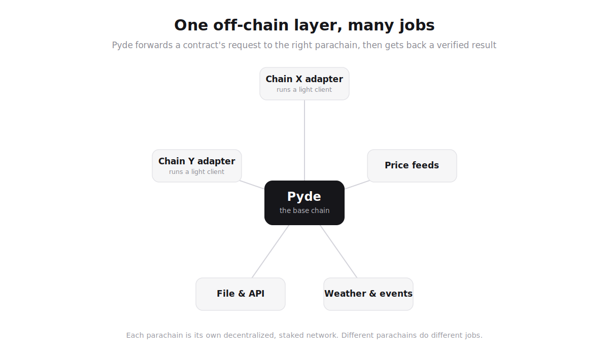
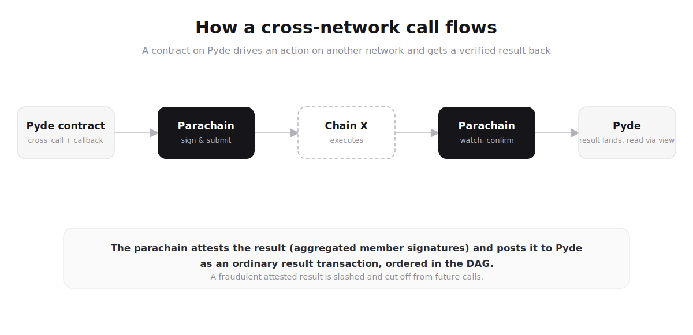
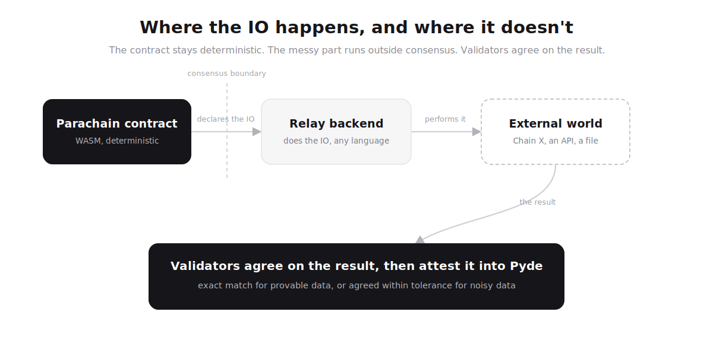

# Chapter 13: Parachains and Cross-Chain

Almost everything an application wants to touch lives outside the chain
it runs on: other networks, price data, real-world events, files,
arbitrary APIs. Pyde reaches all of it through one mechanism, the
**parachain layer**.

A parachain is a small, decentralized, staked network that does one job
the base chain deliberately cannot do on its own, then posts the
result back to Pyde in a form Pyde can check. One parachain speaks to a
foreign chain through that chain's light client. Another publishes
price data. Another reports real-world events or moves files. A
contract on Pyde reaches any of them the same way, through
`parachain_call` with a callback, and what comes back is a verified
result.

This unifies two topics that most ecosystems treat separately:

1. **Cross-chain interoperability.** A bridge to a foreign chain is not
   a separate product bolted onto Pyde; it is one *kind* of parachain,
   an adapter that implements the foreign chain's transaction format
   and runs its light client.
2. **Off-chain data and computation.** Oracles, feeds, and IO are not a
   trusted sidecar; they are parachains too, under the same staking,
   consensus, and slashing rules as everything else in the layer.

**Timing:** the parachain layer is v2, shipping post-mainnet. What v1
locks in is the surface: the `cross_call` host function and the
callback model that `parachain_call` extends, the
`HardFinalityCert` primitive, the
`type = "parachain"` manifest schema in otigen, and the gated parachain
host-function namespace. Contracts written against the interface today
compile and deploy today. The deep mechanics live in
[companion/PARACHAIN_DESIGN.md](../companion/PARACHAIN_DESIGN.md).

---

## 13.1 The Problem: Everything Interesting Is Off-Chain

A chain is deliberately sealed. It cannot make a network request, read
a price, or watch another network, because if it could, every validator
would observe a slightly different answer and consensus would never
close. That seal is the safety property. It is also a wall.

The industry's answers to the wall have been the largest source of
catastrophic loss in the ecosystem's history: trusted bridge multisigs
(Wormhole, Ronin, Nomad, Multichain) and centralized oracle operators.
Each one re-introduces exactly the trusted party the chain existed to
remove.

Pyde's position: keep the wall, build a proper door. The door is a
decentralized, staked network that attests its work into Pyde's own
security, where Pyde re-validates it. Not a multisig. Not an operator
whitelist. Not a promise.

---

## 13.2 The Shape of the Layer



*One off-chain layer, many jobs: every parachain is its own staked,
decentralized network, attesting its results into Pyde's own security.*

Each parachain declares one **capability**: what job it does, what a
request payload looks like, and how its validators agree on a result.
Different parachains implement different things. One can cover several
foreign chains at once; another can be nothing but a single price pair.
The layer grows by deployment, not by protocol change, because the base
chain never learns what any particular parachain does. It only learns
how to check the work.

---

## 13.3 How a Cross-Network Call Flows

A contract on Pyde wants to run a swap on Chain X and act on the
result:



*A contract drives an action on another network and gets a verified
result back: the parachain attests the result and posts it to Pyde as
an ordinary result transaction, ordered in the DAG like any other.*

1. The contract issues a `parachain_call` naming the parachain, the action,
   the payload (target address, function, arguments), and the callback
   to run on the result.
2. The parachain's validators pick up the forwarded request, validate
   it, sign the outbound transaction, and submit it on Chain X.
3. Chain X executes.
4. The parachain watches the transaction through its Chain X light
   client, confirms the receipt, and processes whatever it needs on its
   own side, including its own state.
5. The attested result posts back to Pyde as an ordinary transaction
   of a dedicated result type; the calling contract reads it through a
   view (pull-first), with a push handler form to follow once the
   result path is proven.

The result becomes canonical the same way everything on Pyde does: it
is an ordered transaction, gossiped, sequenced in the DAG, and
dispatched deterministically. The parachain's members attest it with
the same per-member aggregated FALCON signing the base chain's beacon
already uses, so no new consensus primitive exists anywhere in the
path. The work is not just reported: it is recorded, checkable, and
slashable.

If a parachain attests a fraudulent or invalid result, Pyde challenges
it, and until the challenge resolves, Pyde stops forwarding requests
to it. Forwarding cutoff is the liveness lever;
slashing of the offending validators' stake is the economic one. Both
apply.

---

## 13.4 The Call Model: `cross_call` and `parachain_call`

Cross-context invocation in Pyde is exposed as a WASM host function.
The v1 contract-to-contract form:

```rust
// From the WASM contract author's perspective (Rust example):
let result = pyde::cross_call(
    target_address,                    // contract or parachain address
    "request_price",                   // function name
    &args,                             // serialized arguments
    CallbackSpec {
        success_method: "on_price_received",
        error_method:   "on_price_failed",
        max_callback_gas: 100_000,
        timeout_waves:   100,
    },
)?;
```

The same callback model serves three call shapes:

1. **Smart contract → smart contract** via `cross_call` (same chain,
   fully working at v1). Synchronous if both contracts are in the same
   wave; asynchronous via callback if execution spans waves.
2. **Smart contract → parachain** via `parachain_call` (v2, when the
   parachain layer ships). Always asynchronous; the parachain's
   validators process the call and the callback carries the result
   back. `parachain_call` names the parachain, the action, the
   payload, and the callback, and enters the ABI through its additive
   path when the layer ships.
3. **Smart contract → foreign chain** (v2, a `parachain_call` to an
   adapter). There is no separate "foreign transport": reaching
   Chain X *is* a call to the parachain that adapts it. The contract
   never handles foreign formats; the adapter does.

The `cross_call` signature is part of the v1 Host Function ABI
specification and is stable at genesis. Contracts written today against
the v1 interface keep working as the parachain layer comes online.

### Callback context preserved

Every call, `cross_call` and `parachain_call` alike, carries enough
context that the callback can reconstruct what happened:

- `callback_id` (unique per call)
- `original_caller` (address that initiated the original transaction)
- `original_fn` (function that issued the call)
- `original_args_hash` (hash of original args; full args retrievable from the chain log)
- `issued_at_wave` (when the call was issued)
- `target` (who was called)

On result (success, error, or timeout), the callback handler receives
both the result payload and the context. Full audit trail is always
preserved.

---

## 13.5 Anatomy of a Parachain

A parachain has four parts, and the boundary between them is the whole
design:

```text
 ┌──────────────────────────── one operator node ────────────────────────────┐
 │                                                                            │
 │   ┌──────────────────┐  declares IO   ┌──────────────────┐                 │
 │   │ parachain         │───────────────►│ relay backend     │──► real world  │
 │   │ contract (WASM)   │◄───────────────│ (author's, any    │◄── (Chain X,   │
 │   │ deterministic     │  result        │  language)        │     an API...) │
 │   └──────────────────┘                └──────────────────┘                 │
 │             │                                                              │
 │   ┌─────────▼─────────────────────────────────────────────┐                │
 │   │ Pyde-provided operator binary                          │                │
 │   │ networking, peer discovery, stake wiring, result        │                │
 │   │ agreement, attestation + result posting to Pyde         │                │
 │   └───────────────────────────────────────────────────────┘                │
 │                                                                            │
 │   all of it shipped as one canonical Docker image,                          │
 │   its digest pinned in the parachain's on-chain state                       │
 └────────────────────────────────────────────────────────────────────────────┘
```

**The parachain contract** is a WASM module, written and deployed
exactly like a smart contract through otigen, with `type = "parachain"`
in `otigen.toml` unlocking the parachain host-function namespace. It is
pure and deterministic: it validates requests, transforms payloads,
manages the parachain's state, and *declares* any outside-world call it
needs. It never performs IO itself.

**The relay backend** is the author's own service, written in any
language, running beside the contract on every operator node. It
performs the IO the contract declared: submits the Chain X transaction,
fetches the price, uploads the file. It runs outside consensus, where
non-determinism cannot hurt anything.

**The operator binary** is provided by Pyde and is the same for every
parachain. It handles what authors should never have to build:
networking, peer discovery, the connection to the Pyde network, stake
verification, running the agreement rule over results, and posting the
attested result transactions back to Pyde. An operator points it at a parachain id and
a config; it pulls everything else.

**The canonical image.** Each parachain version registers its Docker
image digest in the parachain's on-chain state. Every operator runs the
same verified bytes; drift is detectable; upgrades are explicit state
changes. The image is public so anyone can pull, inspect, and join. And
the image is the messy part, sandboxed, never the trusted part: it is
third-party code on validator hardware, so it runs contained, and the
guarantee comes from validators agreeing on the result, not from
trusting the image.

### Why the IO split is the whole trick



*Determinism inside, reality outside, agreement at the boundary.*

If the contract made the network call itself, every validator would get
a slightly different answer (timing, peers, API jitter) and the
parachain could never agree on a block. So the deterministic core
declares the IO as data (target, method, payload schema, timeout) and
the relay backend performs it outside the agreement path. What comes
back is the result, and the validators' one job is to agree on that
result before it is attested into Pyde. Determinism inside, reality
outside, agreement at the boundary.

### How validators agree on a result

Each parachain declares its agreement rule in config, because data
divides into two honesty classes:

| Data class | Example | Agreement | Trust basis |
|---|---|---|---|
| **Provable** | a Chain X receipt | exact match | verified against Chain X's own consensus via light client; Pyde can re-check it |
| **Attested** | a price, a weather reading, an API response | each validator fetches independently and commits to its value before revealing (the base chain's own commit-reveal, reused), then the median of the revealed quorum within a declared tolerance | validator quorum + stake + slashing; this is an oracle, and the layer says so honestly |

Pyde re-validates what can be re-validated: the aggregated member
attestation, light-client proofs, and the deterministic dispatch of the
result transaction. For attested data, the guarantee is economic: a
quorum of independent staked observers agreed within tolerance, a
minority cannot swing the median, and sitting persistently outside the
tolerance is slashable.

---

## 13.6 Running and Joining a Parachain

The layer is open at both ends.

**Authors** build two things, the parachain contract and its relay
backend, and declare the rest in config: the capability, the agreement
rule, the minimum validator stake, the gas charge for serving requests,
bootnodes, and metadata. Deployment goes through otigen like any
contract. Pyde publishes a conformance spec for what qualifies as a
parachain; conformant parachains receive forwarded calls.

**Operators** join permissionlessly:

```text
 pull by parachain id ──► pass config ──► stake (per the parachain's
 config) ──► binary validates eligibility ──► join the network
```

The Pyde-provided binary handles discovery, peers, and the anchored
connection to the main network. There is no whitelist and no committee
membership prerequisite: eligibility is the stake and the spec,
enforced in code.

**Economics.** PYDE remains the gas token across the layer. Contracts
pay the parachain's declared gas charge when a `parachain_call` is served;
parachain validators earn from serving honestly and lose stake for
serving fraudulently. Parachain authors can layer their own token
economies on top; that is an application concern, not protocol
mechanics.

---

## 13.7 The Proof Machinery Adapters Use

The one piece of cross-chain infrastructure v1 ships implicitly is the
**hard-finality certificate** (Chapter 6):

```rust
struct HardFinalityCert {
    wave_id:              u64,
    blake3_state_root:    Hash,
    poseidon2_state_root: Hash,
    voter_bitmap:         u128,                     // 128-bit bitmap
    signatures:           Vec<FalconSignature>,     // ≥ 85
}
```

This certificate, signed by ≥ 2f+1 = 85 of the active committee, is the
outbound half of any adapter's proof story:

- A counterparty-side verifier holds the active committee's FALCON
  public keys (refreshed at epoch boundaries).
- To accept a Pyde-side event it requires a `HardFinalityCert` for the
  commit that included the event, plus a Merkle proof from the wave's
  `blake3_state_root` (native) or `poseidon2_state_root`
  (ZK-circuit-friendly) to the event's storage slot.
- Verification is `(85 × FALCON_verify) + (one Merkle path)`, feasible
  on any chain with a reasonable VM.

The inbound half is the adapter parachain's light client of the foreign
chain, which is how a Chain X receipt becomes provable data under
§13.5's agreement table. Between the two, an adapter needs no trusted
relay in either direction: Pyde events are proven by finality certs,
foreign events are proven by light clients, and the adapter's own
honesty is staked and slashable.

Three principles carry over from the earlier bridge analysis, now as
requirements on adapter parachains:

1. **No new trusted parties.** No multisig guardians between Pyde and
   the counterparty chain.
2. **Light-client verification.** The foreign chain's finality is
   checked cryptographically, not attested socially.
3. **Verifiable in at least one direction, stated plainly where only
   one.** Chains without practical light clients (probabilistic-
   finality PoW being the hard case) get asymmetric adapters, and the
   asymmetry is declared in the parachain's capability, not hidden.

---

## 13.8 Trust Model, Stated Honestly

What the layer removes:

- The bridge multisig. Outbound foreign-chain transactions are signed
  under the parachain's consensus, not by a fixed keyholder set beside
  it.
- The oracle whitelist. Feeds are open networks anyone can stake into,
  with declared agreement rules, not an operator agreement.
- The silent failure. Every result lands on Pyde as an ordered,
  attested transaction; fraud is challengeable, slashable, and cuts
  off forwarding.

What remains, named rather than waved away:

- **Attested data is attested.** No mechanism makes a price *provable*;
  the layer makes the attestation economic and its rule explicit.
- **Outbound key custody: three keys, not one threshold.** Pyde's own
  consensus stays FALCON, and a parachain attests its results with the
  same per-member aggregated FALCON the beacon already uses, so no
  post-quantum threshold scheme is reintroduced anywhere. Only the key
  that submits on a foreign chain is different, and it has to be: the
  target chain dictates its scheme (a chain that verifies secp256k1
  cannot verify FALCON), so that one foreign-facing key is held under a
  standard MPC scheme across the parachain's validators, never a
  single signer, backed by slashing. The read-only side, oracles and
  provable-state reads, needs no outbound key at all. The operational
  security of that key (ceremony, resharing, making a stolen key
  unprofitable) is a primary open design item.
- **Dispute mechanics.** Challenge windows, the fraud-proof format for
  provable data, and who adjudicates the edge cases are open design,
  tracked in
  [companion/PARACHAIN_DESIGN.md](../companion/PARACHAIN_DESIGN.md),
  not silently assumed solved.
- **Deterministic timeouts.** A request that times out for one
  validator but not another must still resolve to one agreed outcome,
  so the timeout is folded into what the quorum attests rather than
  left to each validator's wall clock. Open design, named as such.

---

## 13.9 What Contracts Can Do Today (v1, No Parachains)

A few cross-chain-adjacent things are possible at the application layer
before the parachain layer ships:

### Off-chain oracle pattern

A contract that needs an external value can define an
`oracle: Address` field, restrict writes to it, and let an off-chain
process submit updates. This is a trusted feed, not a bridge, and it
unlocks DeFi-shaped applications today. The parachain layer is the v2
answer that decentralizes exactly this pattern: same shape, staked and
slashable instead of trusted.

### Mirror tokens

A token contract can represent off-chain assets by trusting a
designated minter. Appropriate when the operator is genuinely trusted
(a regulated custodian); not appropriate as a default bridge.

### Light-client contracts

A developer can deploy a foreign-chain light client as a WASM contract
today, consuming relayed headers and verifying execution proofs
on-chain. The relay is operationally trusted but the verification is
trustless. This is the same pattern an adapter parachain
industrializes: the light client moves into the parachain, the relay
becomes the staked relay backend, and the trust in the relay operator
becomes stake and slashing.

---

## 13.10 What the Plan Looks Like

| Stage | Capability |
| --- | --- |
| **Mainnet (v1)** | Surface locked: `cross_call` + callbacks live for contract-to-contract; `HardFinalityCert` format stable; `type = "parachain"` schema + gated host-fn namespace reserved |
| **Post-mainnet (v2), first wave** | Parachain layer live: operator binary, canonical images, staking + slashing, result transactions; first data-feed parachains |
| **Post-mainnet (v2), second wave** | First chain adapters (light client + threshold outbound signing), starting with one high-value counterparty chain |
| **Later** | ZK-aggregated FALCON verification (collapses proof costs for adapters and committees); zk-WASM proven execution where research heads |

These are directional, gated on the maturity of the previous stage and
on credible auditor capacity, not on a calendar.

---

## Summary

| Capability | At mainnet? | Post-mainnet plan |
| --- | --- | --- |
| Sovereign L1 | Yes | none |
| Hard-finality certificate (format) | Yes | The outbound proof primitive for adapters |
| `cross_call` host function (interface) | Yes | The callback model `parachain_call` extends to parachains, then foreign chains through adapters |
| Smart-contract → smart-contract calls | Yes (working) | Performance optimizations |
| Parachain layer (operator network) | Surface reserved | Ships as v2: staking, attestation into Pyde, result transactions, slashing |
| Smart-contract → parachain calls | Interface only | Live with the layer |
| Foreign-chain reach | No | Through adapter parachains: light clients in, finality certs out, no multisig anywhere |
| Off-chain data (prices, events, IO) | App-layer trusted feeds possible | Decentralized, staked, agreement-ruled parachains |

Pyde at launch is a sovereign network designed not to *depend* on
anything outside itself. The parachain layer then makes the outside
world reachable without importing the trust models that broke
everywhere else: one mechanism, staked and re-validated, from foreign
chains to a weather report.

The next chapter covers the PYDE token: supply, inflation,
distribution, fee mechanics, and staking economics.
