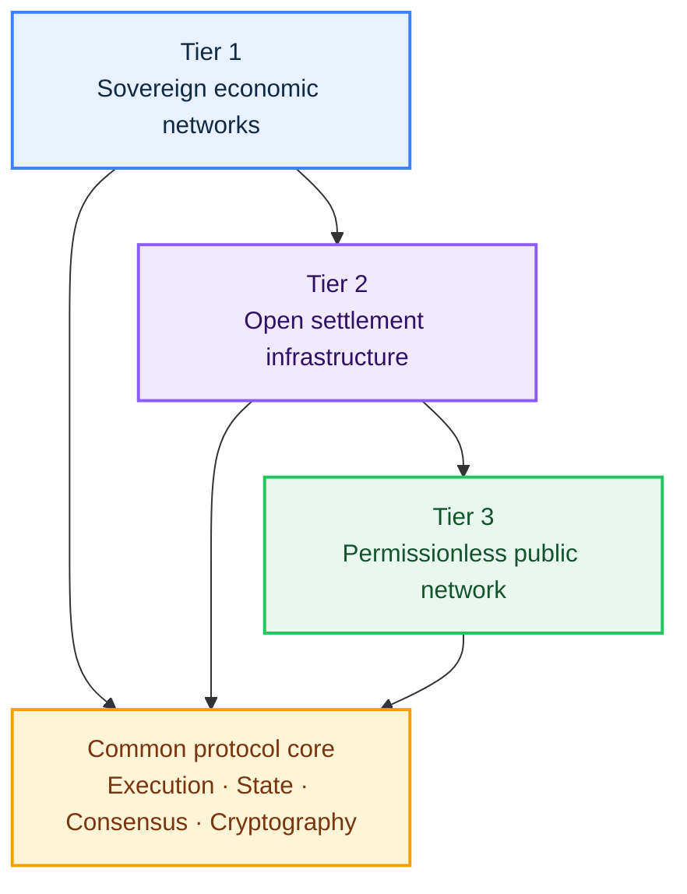
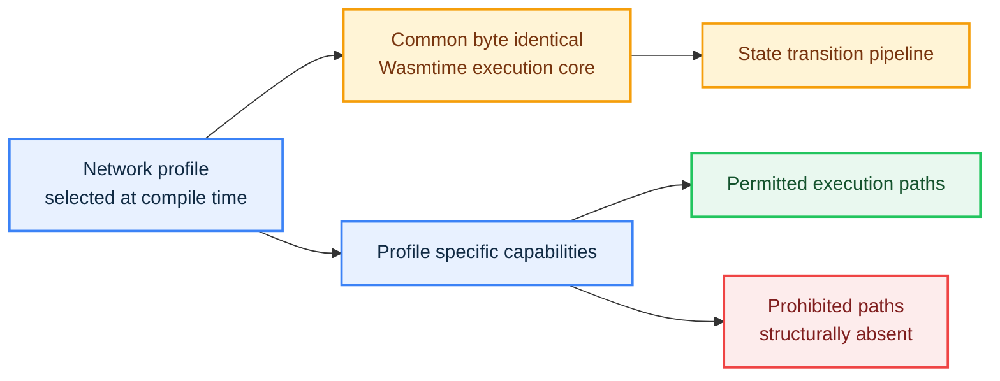
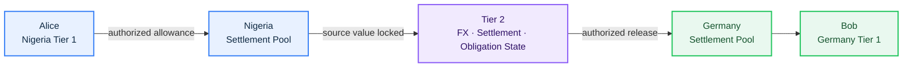
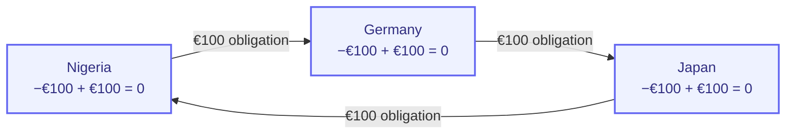

# Pyde

## Distributed Ledger Infrastructure for a Connected Global Economy

_Infrastructure for Global Economic State_

**Version 1.0 | September 2026**

## Abstract

The global economy is digital, but its economic state remains divided across sovereign jurisdictions, financial institutions, enterprises, payment networks, registries, exchanges, and private software systems. Distributed ledger technology (DLT) provides a foundation for sharing verifiable state across independent participants, but the global economy requires more than a single public network or a collection of tokenized assets.

A bank maintains account state. A government maintains regulatory state. An enterprise maintains contracts, invoices, ownership records, and obligations. Identity is established through jurisdictional systems. Cross border commerce then requires these independent systems to coordinate even though each operates under different rules, authorities, and representations of value.

Pyde is distributed ledger infrastructure designed around a broader abstraction: **global economic state**.

Economic activity is not only a collection of assets waiting to be tokenized. It is a continuously changing state of balances, ownership, authorization, identity relationships, obligations, licenses, settlement positions, regulatory conditions, and contractual relationships. Pyde represents these relationships as programmable and verifiable state transitions.

This makes tokenization an application of a broader infrastructure rather than the infrastructure itself.

The architecture is organized into three operating environments.

**Tier 1** provides sovereign consortium networks for domestic economic state and regulated institutional applications. Authorized sovereign agencies operate the validator network, while licensed institutions use the network within the rules of the relevant jurisdiction.

**Tier 2** provides open settlement infrastructure between participating economic domains. Independent validators can operate the network and coordinate foreign exchange observations, cross domain settlement, obligations, positions, and bilateral or multilateral netting.

**Tier 3** provides a permissionless public network for open applications, smart contracts, digital assets, and public economic activity.

The three tiers share a common protocol foundation while maintaining distinct authority boundaries. The shared Wasmtime execution core remains consistent across the architecture, while profile specific capabilities can be excluded at compile time so that prohibited execution paths are structurally absent rather than merely hidden behind application level permissions.

Pyde is therefore designed to connect sovereign economies, institutions, open settlement infrastructure, and permissionless applications without requiring them to become the same system or surrender the authority of their respective domains.

### Scope

This paper defines the Pyde distributed ledger architecture, operating model, state model, settlement mechanism, technical foundation, economic model, security boundaries, and principal interaction rules.

The architecture describes how the protocol is structured and how its components interact. A protocol architecture does not itself constitute legal adoption, regulatory approval, or an unconditional production performance guarantee.

## Contents

1. [I. The Economic Infrastructure Gap](#i-the-economic-infrastructure-gap)
2. [II. The Pyde Model](#ii-the-pyde-model)
3. [III. The Three Tier Architecture](#iii-the-three-tier-architecture)
4. [IV. Tier 1: Sovereign Consortium Infrastructure](#iv-tier-1-sovereign-consortium-infrastructure)
5. [V. Tier 2: Interlinking Settlement Infrastructure](#v-tier-2-interlinking-settlement-infrastructure)
6. [VI. Tier 3: Permissionless Infrastructure](#vi-tier-3-permissionless-infrastructure)
7. [VII. Governance and Institutional Integration](#vii-governance-and-institutional-integration)
8. [VIII. Technical Architecture](#viii-technical-architecture)
9. [IX. Resilience and Security](#ix-resilience-and-security)
10. [X. Economics and Design Principles](#x-economics-and-design-principles)
11. [XI. Operating Model](#xi-operating-model)
12. [XII. The Pyde Thesis](#xii-the-pyde-thesis)
13. [Appendices](#appendices)

# I. The Economic Infrastructure Gap

The global economy is deeply digital, but it is not digitally unified. Economic activity is represented across sovereign monetary systems, banks, payment networks, government registries, enterprises, exchanges, custodians, identity systems, and private software platforms. Each system performs a specific function and can operate correctly within its own domain, yet the global economy still depends on these systems being able to interact with one another.

That interaction is where much of the infrastructure gap appears. A single economic relationship can require identity to be established in one system, ownership to be established in another, authorization to be checked somewhere else, value to move through a payment system, and the resulting state to be reconciled across multiple records. The individual systems do not necessarily fail. The friction exists at their boundaries because each system maintains its own representation of economic state, its own authority, and its own rules.

The effects become more significant when economic activity crosses institutional and national boundaries. A cross border transaction can involve sovereign currencies, banking systems, compliance requirements, foreign exchange processes, settlement instructions, liquidity arrangements, and reconciliation systems. The payment itself is only one component of the economic relationship. The surrounding process must establish that the parties are authorized to act, that the relevant value exists, that the applicable exchange rate is accepted, that settlement liquidity is available, and that the resulting obligations and positions are recorded consistently.

This fragmentation limits how easily economic activity can compose across systems. A payment system may know that value moved without directly representing the commercial obligation that caused the movement. A property registry may maintain authoritative ownership information without sharing that state directly with the financial infrastructure financing the property. A sovereign monetary system may maintain the authoritative value of its currency while international commerce still requires separate coordination mechanisms to connect that value to another jurisdiction. As more institutions and jurisdictions participate, more economic relationships have to be reconciled across these boundaries.

The challenge is therefore not simply to make one payment network faster. It is to provide infrastructure through which independently governed economic systems can represent, verify, and coordinate state without requiring them to surrender their authority or become identical.

Existing financial and distributed systems already solve important parts of this problem. Payment networks move value between institutions. Banking systems maintain account and liability state. Settlement infrastructure coordinates transactions between participants. Permissioned distributed ledgers provide shared state for defined groups, while permissionless networks provide open programmability and public consensus. These systems demonstrate that individual parts of the broader coordination problem are solvable. The remaining challenge is how those different economic environments can participate in a common programmable architecture without losing the authority boundaries that define them.

Distributed ledger technology provides a natural foundation for this coordination because it can maintain shared, verifiable state across independent participants. But the architecture required for a global economy is broader than a single permissionless network. A sovereign monetary system has different authority requirements from an open settlement network. An institutional application has different requirements from a public smart contract. A cross border settlement layer must coordinate between domains without becoming the sovereign authority over their currencies.

Pyde is designed around that distinction. It treats **global economic state** as the broader infrastructure abstraction: the continuously changing state of balances, ownership, authorization, identity relationships, obligations, licenses, settlement positions, regulatory conditions, and contractual relationships that make economic activity possible. Tokenization becomes one application of this infrastructure rather than the definition of it.

The architecture therefore separates economic participation into three environments. Tier 1 provides sovereign consortium networks for domestic economic state and regulated institutional applications. Tier 2 provides open interlinking settlement infrastructure for cross domain coordination, including foreign exchange observations, settlement, obligations, positions, and netting. Tier 3 provides the permissionless public environment for applications, smart contracts, digital assets, and public economic activity.

The purpose of the three tier model is not to replace every existing economic system. It is to provide a common distributed ledger foundation through which independent systems can interact where the relevant authorities permit them to do so, while keeping authority over each economic domain explicit.

# II. The Pyde Model

## II.1 Programmable Global Economic State

Pyde provides infrastructure for representing economic relationships as programmable state transitions.

The model rests on three principles.

First, economic state is verifiable.

Second, authority over that state remains with the domain responsible for it.

Third, independent domains can interact without becoming one authority.

Those principles produce three operating environments:

| Tier   | Economic domain | Primary role                                                          |
| ------ | --------------- | --------------------------------------------------------------------- |
| Tier 1 | Sovereign       | Domestic economic state and regulated institutional applications      |
| Tier 2 | Interlinking    | Cross domain settlement, FX data, obligations, positions, and netting |
| Tier 3 | Permissionless  | Open contracts, applications, assets, and public economic activity    |

The tiers share protocol technology while retaining separate authority boundaries.

## II.2 One State Model, Different Authority Models

The three tiers are not three unrelated products.

They are different operating environments built around a common protocol foundation. Account execution, state management, cryptographic verification, deterministic state transitions, smart contract execution, and transaction processing follow the same core architectural principles.

What changes is the authority surrounding those transitions.

Tier 1 constrains participation to authorized sovereign agencies and licensed institutions. Tier 2 permits open validator participation while governing the shared state used for cross domain coordination. Tier 3 is permissionless.

This distinction is fundamental. Pyde does not use one unrestricted runtime and rely on a collection of application level permissions to pretend that three different systems exist. Capabilities that are fundamentally incompatible with a network profile can be removed at compile time.

## II.3 The Three Economic Environments

**Tier 1 is the sovereign environment.** It represents domestic economic state under the authority of participating sovereign agencies.

**Tier 2 is the coordination environment.** It represents cross domain relationships such as foreign exchange observations, settlement obligations, positions, and netting state.

**Tier 3 is the public environment.** It represents permissionless economic activity and provides an open platform for developers and users.

The boundary between these environments is explicit. Participation in one tier does not automatically grant authority in another.

# III. The Three Tier Architecture

## III.1 Architecture Overview

The architecture can be viewed as three connected domains with a common protocol foundation beneath them.



Tier 1 preserves domestic authority. Tier 2 provides shared coordination between participating domains. Tier 3 provides the open economic environment.

## III.2 Tier 1: Sovereign Consortium Network

Tier 1 is operated by authorized sovereign agencies within a jurisdiction. Validator participation is permissioned, and the validator set is determined by the sovereign governance model.

Typical validator agencies can include a central bank, finance ministry, treasury authority, tax authority, or other legally authorized public institution.

The architecture is deliberately multi node. Domestic economic state is therefore maintained through independent validator nodes participating in consensus rather than a single machine acting as the ledger.

## III.3 Tier 1 Consensus

Tier 1 uses Byzantine fault tolerant consensus.

A state transition becomes canonical only after the configured quorum threshold agrees. The intended baseline is a two thirds quorum, although the validator composition and exact configuration belong to the participating jurisdiction.

This design prevents a single operator from unilaterally rewriting the consortium state.

The quorum rule applies to important state transitions, including monetary operations and regulatory state changes.

## III.4 Tier 1 and Tier 3 Have Different Execution Surfaces

Tier 1 adds sovereign regulatory state, institutional licensing, KYC linked restrictions, controlled monetary operations, and permissioned validators.

Tier 3 provides open participation and public smart contract deployment.

The difference is not limited to runtime authorization.

Network profiles can be selected at compile time so that capabilities prohibited by a profile are excluded from the resulting execution environment. If arbitrary public contract deployment is not permitted by a Tier 1 profile, its corresponding deployment capability is absent from that profile's executable environment.

A validator cannot enable a capability that does not exist in the compiled execution path merely by changing an application level permission.

This is the principle of **structural absence**.

A prohibited capability is not merely hidden. Where the protocol profile permits it, the relevant execution path is absent from the binary.

## III.5 Common Protocol Architecture

The shared execution architecture is built around a common Wasmtime execution core.

The core execution environment remains byte identical across the relevant network profiles, while profile specific capabilities are selected at compile time. The result is a common execution foundation with intentionally different executable surfaces.



Runtime authorization remains necessary for actions that exist within the selected profile. Compile time structural absence removes capabilities that do not belong in that profile at all.

## III.6 Tier 2 and Tier 3 Are Different Networks

Tier 2 does not become Tier 3.

Tier 2 exists to maintain shared cross domain settlement state. Tier 3 exists as a public permissionless economic network.

A Tier 2 validator does not automatically become a validator of a participating Tier 1 consortium. Participation in Tier 3 does not automatically grant authority over a sovereign network.

Each tier remains governed by its own consensus and authorization rules.

## III.7 Architecture at a Glance

| Layer  | Represents                           | Participation                                           |
| ------ | ------------------------------------ | ------------------------------------------------------- |
| Tier 1 | Sovereign domestic economic state    | Authorized sovereign agencies and licensed institutions |
| Tier 2 | Cross domain economic coordination   | Open validators and participating sovereign networks    |
| Tier 3 | Permissionless public economic state | Anyone subject to public network rules                  |

The architecture does not require every economic participant to operate the same kind of network. It provides a common protocol foundation through which independently governed domains can become interoperable.

# IV. Tier 1: Sovereign Consortium Infrastructure

## IV.1 Sovereign Economic Domain

Each Tier 1 network represents the economic domain of a participating jurisdiction.

The sovereign controls its monetary rules, validator eligibility, institutional authorization, regulatory state, and applicable legal framework.

The consortium provides programmable domestic economic state without transferring sovereign authority to a third party.

## IV.2 Native Sovereign Currency

The native monetary asset of a Tier 1 consortium represents the jurisdiction's sovereign digital currency.

The denomination and monetary rules are determined by the jurisdiction. Examples can include a digital naira, digital yen, digital euro, or another sovereign monetary asset.

Pyde does not determine the monetary policy of the sovereign.

The sovereign determines issuance, redemption, regulatory treatment, authorized institutions, account restrictions, and applicable law.

## IV.3 Minting

Minting represents the creation of a sovereign monetary liability.

It is therefore not an ordinary smart contract operation.

Minting is authorized through the consortium's governance and consensus rules, and newly created supply is credited to the authorized sovereign monetary account.

## IV.4 Burning

Burning removes sovereign monetary units from circulation according to the jurisdiction's monetary rules.

Like minting, burning is subject to the consortium's authorization and quorum requirements.

Tier 2 does not burn participating sovereign currencies as part of its fee mechanism.

## IV.5 One Account Model

Pyde uses a common account model rather than creating fundamentally different wallet systems for every tier.

An account contains a deliberately small state model:

| Field       | Purpose                                                       |
| ----------- | ------------------------------------------------------------- |
| `nonce`     | Prevents replay and sequences account transactions            |
| `balances`  | Records asset balances                                        |
| `code_hash` | Identifies associated contract code when applicable           |
| `status`    | Records protocol or regulatory state                          |
| `kyc_id`    | Optional reference to an off chain regulatory identity record |

The account is controlled cryptographically through its key. `kyc_id` is only a reference; the underlying identity document and personal information are not required to live on chain.

## IV.6 Account Creation Is Not Sign Up

Creating an account in Pyde means creating the corresponding on chain account state.

It does not mean creating a website profile, registering for a service, signing up with an institution, or logging in.

An account can therefore exist before regulatory verification. A consortium can still restrict regulated value movement until the required verification and authorization state is present.

This distinction keeps the protocol account model separate from user authentication and from off chain legal identity.

## IV.7 Cross Domain Addresses

An address is not inherently owned by a particular tier.

The same cryptographic address can be used across Pyde domains, while each domain applies its own rules.

The address itself is not a legal identity. Its relationship to a person, company, institution, or other real world entity is established through the applicable jurisdictional or institutional records.

A Tier 1 consortium can require KYC for regulated activity. Tier 3 can allow an address to participate in the public network without sovereign authorization merely to create or use an account.

## IV.8 Multiple Entities and Legal Identity

An address can be associated with multiple real world entities or roles when the relevant institutional or jurisdictional records authorize that relationship.

The address remains only a cryptographic identifier.

Legal identity, ownership, agency, institutional capacity, and licensing remain established outside the address through the applicable legal and regulatory systems.

## IV.9 KYC Is Jurisdictional

Pyde does not replace national KYC infrastructure.

A jurisdiction can use existing identity frameworks such as national identity numbers, passports, driver's licenses, tax identifiers, corporate registration, and existing banking KYC.

The consortium can associate a verified regulatory reference with an account while keeping the underlying identity record outside the ledger.

## IV.10 Regulatory State

Authorized regulatory agencies can change an account's regulatory state through authorized state transitions.

Typical states can include active, restricted, frozen, discontinued, or other jurisdiction defined states.

The exact state machine belongs to the consortium.

## IV.11 Institutional Participation

Institutions participate through licensed identities, service accounts, and approved smart contracts.

A license establishes the institutional authorization under which the organization operates. The protocol enforces the protocol level consequences of that authorization, while the institution remains responsible for operating within its license and applicable law.

Participating institutions can include commercial banks, insurers, real estate companies, payment companies, trade finance providers, exchanges, licensed financial institutions, and other regulated enterprises.

## IV.12 Institutional Contracts

An institution can deploy contracts representing its own business logic.

These contracts can support customer registries, escrow, lending, asset management, trade finance, insurance, corporate accounting, real estate records, compliance workflows, and other institutional processes.

The institution remains responsible for its own business logic and legal obligations.

The protocol does not attempt to encode every possible business regulation into smart contract bytecode.

## IV.13 Contract Upgrades

Institutional contracts can be upgradeable.

The upgrade authority belongs to the institution according to the approved contract configuration and the rules under which the contract operates.

This permits an institution to update business logic without changing the sovereign network itself, while higher level sovereign regulatory controls remain separate.

## IV.14 Sovereign Ownership and Bank Mediated Claims

Pyde can represent both direct ownership of sovereign currency and bank mediated claims.

In a direct ownership model, a user holds sovereign tokens in their own account.

In a bank mediated model, the user holds a claim against a bank while the underlying sovereign currency is held by the bank.

The legal characterization depends on the applicable banking framework. Pyde supplies the programmable infrastructure without redefining national banking law.

## IV.15 Regulatory Freeze

Authorized regulatory agencies can freeze an account through an authorized state transition.

Once the required transition reaches finality, the account's protocol level restriction becomes part of canonical state.

A freeze does not automatically transfer ownership.

## IV.16 Institutional Freeze and Unfreezing

A licensed institution can also restrict a customer relationship within the scope of its contract and regulatory obligations.

A frozen account can return to an active state through the authorized regulatory or institutional process.

## IV.17 Seizure

Freezing is distinct from seizure.

A freeze changes the account's ability to perform permitted actions. It does not itself transfer ownership.

A legally authorized process, such as a court order, can require a transfer. The resulting transfer is then executed through the applicable institutional or sovereign process.

# V. Tier 2: Interlinking Settlement Infrastructure

## V.1 Purpose

Tier 2 connects participating Tier 1 economic domains.

It is an open network. Anyone meeting the validator requirements can run the Tier 2 binary, stake according to the network's rules, and participate in consensus.

Tier 2 does not become a validator of Tier 1 networks. It does not replace sovereign consensus. It does not own participating sovereign currencies.

Its purpose is to maintain the common state required for cross domain economic coordination.

## V.2 What Tier 2 Represents

Tier 2 maintains four closely related forms of cross domain state.

**Foreign exchange state** records validator observations and the aggregated reference data used by settlement.

**Obligation state** records what one participating economic domain owes another as a result of cross domain activity.

**Position state** records the net economic exposure that remains after relevant obligations are considered.

**Settlement state** records the conditions and actions required to move sovereign value through authorized settlement pools.

These are related components of one coordination layer rather than separate products.

## V.3 Foreign Exchange Oracle

Tier 2 validators independently provide foreign exchange observations.

The network aggregates those observations according to the oracle rules and records a consensus supported reference state that participating settlement contracts can consume.

The oracle can support other cross domain reference information where the protocol defines an appropriate source and aggregation rule. It records consensus supported observations; it does not independently establish the truth of an external fact.

## V.4 Settlement Pools

Each participating consortium can deploy a standardized settlement contract on its own Tier 1 network.

The contract maintains a pool of sovereign currency dedicated to authorized cross border settlement. Tier 2 receives the authority required to move funds within that pool, according to the settlement contract.

Tier 2 does not directly custody the sovereign assets.

The German consortium maintains its own settlement pool. The Nigerian consortium maintains its own settlement pool. Each pool remains inside its respective sovereign domain.

A sovereign monetary authority controls the funding and withdrawal of its pool through its own Tier 1 process. The pool is for cross border settlement liquidity; it is not a general purpose account controlled by Tier 2.

A participating consortium accepts the standardized settlement contract and thereby defines the rules under which the settlement layer can operate.

Those rules identify the pool, supported assets, granted authority, permitted operations, limits, and settlement conditions.

The sovereign therefore chooses to participate in the coordination layer without surrendering control over its broader monetary system.

## V.5 Cross Border Settlement

Consider a transaction in which Alice in Nigeria wants to send the equivalent of €20 to Bob in Germany.

Alice holds Nigerian sovereign currency, not euros.

The settlement operation proceeds through the following logical sequence.

### V.5.1 Authorization

Alice authorizes the settlement operation from her account.

The settlement layer does not receive unrestricted access to her funds. It operates through the relevant allowance or authorization.

### V.5.2 Source Validation

The source consortium evaluates the conditions required for the transaction.

These include Alice's authorization, account status, regulatory restrictions, balance, settlement allowance, applicable FX data, fees, and the Nigerian settlement pool configuration.

### V.5.3 FX Calculation

Tier 2 supplies the applicable foreign exchange reference.

The transaction calculates the amount of Nigerian currency corresponding to the requested euro amount.

### V.5.4 Source Pool

The required Nigerian currency, including any applicable settlement fee, moves from Alice's account into the Nigerian settlement pool.

The completed source transition creates or updates the corresponding cross domain obligation in Tier 2.

### V.5.5 Destination Pool

The German settlement pool releases the corresponding euro value.

The settlement contract has the authority to perform that operation inside the German consortium.

### V.5.6 Recipient

The German settlement pool transfers the authorized amount to Bob.

The cross domain operation is considered complete only when the required state transitions satisfy the relevant settlement and consensus conditions.



## V.6 Preflight Simulation

Before the state transition is committed, the settlement operation can be simulated against the relevant state.

The simulation checks authorization, account status, allowance, FX data, fees, destination liquidity, and other required settlement conditions without modifying state.

The simulation is a preflight check, not a substitute for consensus.

The actual state transition then proceeds according to the settlement and consensus rules.

The logical settlement can therefore be treated as one coordinated operation even though the state transitions occur in the participating domains.

## V.7 Obligation

An **obligation** is a recorded statement that one participating economic domain owes value to another as a result of cross domain economic activity.

For example:

```text
Nigeria → Germany: €20
```

means that Tier 2 records a €20 obligation associated with Nigeria and Germany.

The obligation is not money held by Tier 2.

It is a record of economic liability between participating domains.

Because different domains can use different sovereign currencies, an obligation retains the currency denomination and settlement information required to value and reconcile it. Cross currency netting uses the applicable FX state rather than treating different currencies as directly interchangeable.

## V.8 Position

A **position** represents the net economic exposure of a participant or domain after relevant recorded obligations are taken into account.

For example:

```text
Nigeria owes Germany: €100
Germany owes Nigeria: €40
```

produces the bilateral net position:

```text
Nigeria owes Germany: €60
```

Positions allow the network to reason about net exposure instead of treating every transaction as an isolated gross transfer.

Netting is an accounting operation over recorded obligations. It does not require Tier 2 to hold the underlying sovereign currencies.

## V.9 Bilateral Netting

Where two participants owe one another, their obligations can be offset according to the settlement rules.

This reduces the gross amount requiring movement while preserving the economic relationship represented by the recorded state.

## V.10 Multilateral Netting

The same principle extends across multiple participants.

Consider:

```text
Nigeria → Germany: €100
Germany → Japan: €100
Japan → Nigeria: €100
```



The network can identify that every participant has a zero net position.

No additional gross movement is required merely to cancel the circular claims.

Real networks are less balanced.

Consider:

```text
Nigeria → Germany: €100
Germany → Japan: €80
Japan → Nigeria: €60
```

The relevant obligations are offset against one another and the remaining imbalance becomes residual position state.

## V.11 Residual Positions and Future Settlement

Netting does not require every participant to reach zero at the end of every period.

If Nigeria remains exposed to Germany after netting, that position remains recorded.

A later trade can create an opposing obligation:

```text
Germany → Nigeria: €50
```

The new obligation can then offset the existing position.

Tier 2 therefore represents a continuing settlement relationship rather than a requirement to move gross value after every transaction.

## V.12 Residual Settlement

At defined settlement intervals, the network calculates outstanding positions.

Participating sovereign monetary authorities can reconcile residual positions through their authorized processes. A sovereign authority can replenish its settlement pool to support future activity or withdraw liquidity according to the applicable rules.

Tier 2 maintains the shared obligation and position state used to determine residual exposure. It does not become the owner of sovereign monetary assets.

# VI. Tier 3: Permissionless Infrastructure

## VI.1 Public Network

Tier 3 is Pyde's permissionless public network.

Anyone can create an account, deploy smart contracts, build applications, hold supported assets, interact with contracts, operate network infrastructure subject to protocol rules, and participate in public economic activity.

Creating an account remains a protocol action, not a website login or service registration.

## VI.2 Public Application Environment

Tier 3 provides the open environment required for permissionless applications.

Applications can include decentralized finance, markets, gaming, identity applications, public asset systems, financial infrastructure, social applications, and other programmable economic systems.

The permissionless environment provides an innovation layer complementary to the regulated consortium networks.

# VII. Governance and Institutional Integration

## VII.1 Authority Is Domain Specific

Pyde deliberately separates authority into domains.

The architecture does not assign one participant control over sovereign monetary policy, institutional business logic, cross border coordination, and permissionless application execution.

Instead, each tier controls the state and actions appropriate to its role.

## VII.2 Sovereign Authority

Tier 1 sovereign authority covers domestic validator eligibility, monetary issuance, domestic regulatory state, institutional licensing, and jurisdiction specific rules.

The sovereign remains responsible for the legal and regulatory meaning of the state represented on its network.

## VII.3 Institutional Authority

Institutional authority covers institutional contracts, customer relationships, business logic, institution specific compliance, and authorized contract upgrades.

The institution operates within the license and legal framework established by the relevant jurisdiction.

## VII.4 Tier 2 Network Authority

Tier 2 authority covers cross domain settlement state, FX aggregation, obligation recording, position tracking, netting, and Tier 2 consensus.

Tier 2 authority exists over the shared coordination state. It does not extend into the broader sovereign monetary systems of participating networks.

## VII.5 Permissionless Authority

Tier 3 follows its public consensus, validator, and smart contract rules.

Public applications operate inside the capabilities and limitations of the permissionless environment.

## VII.6 Cross Tier Interaction

The three tiers can interact without becoming identical.

| Domain | Connects to | Example                                                                                                                     |
| ------ | ----------- | --------------------------------------------------------------------------------------------------------------------------- |
| Tier 1 | Tier 2      | A sovereign settlement pool participates in cross border settlement                                                         |
| Tier 1 | Tier 3      | Jurisdictionally permitted economic state is represented in a public application through an explicitly authorized mechanism |
| Tier 2 | Tier 3      | Settlement infrastructure interacts with a permissionless application where the relevant contracts and rules permit it      |

A cross tier interaction does not automatically transfer the legal status of an asset from one domain to another.

The receiving domain applies its own authorization, contract, and regulatory rules.

## VII.7 Open Tier 2 Infrastructure

Tier 2 is designed as open infrastructure.

Anyone meeting the validator requirements can operate the Tier 2 binary and participate in maintaining shared settlement state.

This differs deliberately from Tier 1, where validator eligibility belongs to the sovereign consortium.

```text
Tier 1
Permissioned validator participation

Tier 2
Open validator participation

Tier 3
Permissionless public network
```

No single company or sovereign authority is intended to control the Tier 2 clearing layer.

## VII.8 Institutional Integration

Pyde is designed to integrate with existing institutional systems rather than requiring institutions to replace their entire technology stack.

An institution can retain its existing databases, accounting systems, customer applications, internal controls, and compliance infrastructure.

It connects those systems to Pyde through authorized smart contracts, APIs, and integration components.

Pyde therefore acts as a programmable coordination layer rather than requiring every institution to become a greenfield distributed ledger company.

## VII.9 Economic Applications

### VII.9.1 Cross Border Trade

A company purchasing goods across borders can coordinate invoice creation, institutional verification, FX calculation, payment authorization, settlement, trade documentation, and reconciliation through applications built on the relevant Pyde layers.

Tier 1 provides the regulated domestic environment. Tier 2 coordinates the cross border settlement relationship. Institutions provide the business applications.

### VII.9.2 Property and Real Estate

A real estate institution can deploy contracts representing property records and associate digital state with licensed institutions, property identifiers, ownership information, regulatory approvals, and relevant legal state.

The ledger does not independently prove that a physical property exists.

Instead, it provides a shared and auditable representation of state maintained by accountable institutions within the relevant jurisdiction.

### VII.9.3 Banking and Financial Services

Banks can deploy contracts supporting customer registries, deposits, lending, escrow, compliance, interest calculations, corporate accounts, and settlement relationships.

The bank can continue operating its internal systems while using Pyde as a shared programmable coordination layer.

### VII.9.4 Enterprise Coordination

Enterprises can coordinate invoices, supply chain events, trade finance, ownership, licensing, escrow, payments, and corporate obligations through consortium infrastructure.

The institution remains responsible for its own business logic and regulatory obligations.

## VII.10 What Pyde Provides

Pyde provides the protocol infrastructure required to connect the different economic domains.

This includes execution, state management, cryptography, consensus, smart contracts, account infrastructure, cross domain settlement mechanisms, oracle infrastructure, network software, and developer tooling.

## VII.11 What Pyde Does Not Control

Pyde does not determine a country's monetary policy, citizenship, tax law, property law, banking law, court decisions, or sovereign regulatory policy.

Those remain external authorities.

The protocol provides infrastructure through which those authorities can express and enforce relevant digital state.

# VIII. Technical Architecture

## VIII.1 Technical Foundation

The three tier architecture is built on a common distributed ledger protocol foundation.

The technical stack described by the protocol includes WebAssembly execution, Wasmtime, Cranelift AOT compilation, parallel execution, Jellyfish Merkle state, FALCON-512, BLAKE3, Poseidon2, a Mysticeti style DAG consensus architecture, smart contract infrastructure, and developer tooling.

The same technical foundation supports the broader architecture while different profiles apply different authority and capability boundaries.

## VIII.2 Execution Layer

Pyde uses WebAssembly execution with Wasmtime and Cranelift AOT compilation.

Smart contracts can target WebAssembly through languages including Rust, AssemblyScript, Go or TinyGo, and C or C++.

The execution model supports multi threaded parallel execution.

Transactions whose read and write sets do not conflict can execute concurrently across multiple CPU cores. Optimistic execution and MVCC style conflict validation allow the scheduler to run independent work in parallel while preserving deterministic final state.

This property matters directly to cross border settlement.

A large settlement workload can contain many independent operations across different corridors, pools, accounts, and netting relationships. Where those operations do not touch the same state, they can execute concurrently rather than waiting behind a universal sequential path.

The scheduler validates read and write dependencies. Conflicting operations can be re executed, while the canonical result remains deterministic across validators.

The architecture does not assume linear scaling with CPU count. Contention, state dependencies, networking, I/O, consensus, and storage remain real constraints.

The architectural advantage is that independent economic activity has a parallel execution path instead of a universally sequential one.

## VIII.3 Native Settlement Execution

Cross domain settlement logic executes inside the protocol state transition pipeline.

The settlement mechanism therefore does not depend on an asynchronous external middleware process to perform the actual ledger state transitions.

The protocol can execute authorization checks, pool operations, obligation recording, and related state changes through its native execution environment.

Pyde's Tier 3 design targets sub second finality, with approximately 500 ms as a design target. That target is a protocol design target and is not an unconditional end to end latency guarantee for every cross border transaction.

Cross border performance also depends on validator topology, participating networks, network conditions, hardware, workload, and the state involved in the operation.

## VIII.4 State Layer

Pyde uses a Merkle based state architecture.

The protocol state model uses a Jellyfish Merkle Tree with hybrid hashing.

The state root provides a cryptographic commitment to the state represented by the network. That state can include balances, account status, contract state, obligations, positions, regulatory references, and other protocol defined data.

This is the technical basis of the global economic state model.

The protocol does not merely move tokens. It commits to the state from which economic relationships can be verified and executed.

## VIII.5 Cryptography

Pyde treats post quantum cryptography as a core architectural consideration.

The protocol cryptographic stack includes:

| Primitive              | Role                                                                               |
| ---------------------- | ---------------------------------------------------------------------------------- |
| FALCON-512             | Transaction and consensus related signatures                                       |
| BLAKE3                 | Hashing requirements within the protocol                                           |
| Poseidon2              | Hashing requirements suited to the relevant protocol circuits and state operations |
| ML KEM or Kyber family | Transport protection and key encapsulation where applicable                        |

The three tier architecture inherits this cryptographic foundation while applying different authorization and governance rules.

## VIII.6 Consensus

Consensus establishes the canonical state of each network.

For Tier 1, the validator set is defined by the sovereign consortium.

For Tier 2, validator participation is open subject to the network's validator requirements.

For Tier 3, validator participation follows the public network consensus rules.

The fundamental requirement is common:

> **A state transition becomes canonical only after the required consensus threshold has been reached.**

The Tier 3 design uses a Mysticeti style DAG architecture with a two thirds Byzantine quorum. The protocol specification describes a 128 member committee with an 85 member quorum.

These parameters describe the protocol design rather than an unconditional production guarantee.

## VIII.7 Finality

Finality means that the network has reached sufficient consensus for the state transition to be considered committed under the protocol rules.

The Tier 3 design targets sub second finality, with approximately 500 ms as the design target.

Actual finality depends on validator geography, network conditions, hardware, workload, committee configuration, and implementation conditions.

Performance figures therefore remain tied to the conditions under which they are measured.

## VIII.8 Security Model

The security model is built from several independent properties.

### VIII.8.1 Cryptographic Security

Accounts and consensus messages rely on the cryptographic primitives defined by the protocol.

### VIII.8.2 Consensus Security

Each network assumes that Byzantine behavior remains below its configured safety threshold.

### VIII.8.3 Execution Determinism

All validators produce the same state transition for the same canonical transaction sequence and canonical state.

### VIII.8.4 Contract Isolation

Smart contracts execute inside the defined execution environment and cannot arbitrarily access validator resources.

### VIII.8.5 Authorization

Sensitive operations require the appropriate account, institutional, regulatory, or consensus authorization.

# IX. Resilience and Security

## IX.1 Failure Isolation

Pyde is designed so that failure in one operating domain does not automatically become failure in every domain.

Tier 1 domestic state, Tier 2 cross domain state, and Tier 3 public state remain distinct protocol environments.

That separation limits the blast radius of failures and keeps the authority of each domain explicit.

## IX.2 Validator Failure

A validator becoming unavailable does not by itself change canonical state.

Safety depends on the fault assumptions and quorum requirements of the relevant network.

## IX.3 Network Partition

A network partition can prevent the required quorum from being reached.

When quorum cannot be safely reached, affected state transitions do not finalize until consensus can continue.

## IX.4 Conflicting State

Conflicting proposals are resolved by consensus.

A proposal that does not obtain the required quorum does not become canonical state.

## IX.5 Contract Failure

A failed or compromised institutional contract can be restricted or disabled through the applicable institutional and consortium controls.

Higher level sovereign regulatory state remains separate from institution level business logic.

## IX.6 Oracle Disagreement

If validator observations do not satisfy the Tier 2 aggregation rules, the network does not treat an unsupported value as authoritative.

Settlement operations that require unavailable or invalidated oracle state can pause until an acceptable state is available.

## IX.7 Institutional Failure

An institution can lose its license, become insolvent, or cease operating.

The relevant consortium can freeze or restrict the institution, revoke its authorization, disable its contract, or initiate legally authorized recovery processes.

## IX.8 Settlement Pool Exhaustion

If a destination settlement pool lacks sufficient liquidity, a cross border operation requiring that liquidity cannot complete.

The pool remains under the funding and withdrawal authority of the participating sovereign monetary authority.

## IX.9 Sovereign Withdrawal

A consortium leaving Tier 2 reconciles its outstanding obligations and positions according to the participation and settlement rules applicable to that network.

Historical state required to establish those obligations remains available to the participating networks according to the relevant retention and governance rules.

## IX.10 Protocol Vulnerabilities

A protocol vulnerability is handled through security response, containment, governance action, software remediation, and coordinated deployment of a corrected implementation where required.

## IX.11 Security and Audit

Security is a prerequisite for economic infrastructure.

Critical protocol components are subject to independent security review and adversarial testing. Priority areas include consensus, account state transitions, monetary operations, settlement contracts, oracle aggregation, cross domain execution, institutional upgrade mechanisms, cryptographic implementations, and state transition logic.

Security review can include independent code audits, adversarial testing, and formal verification where the risk profile warrants it.

Security does not depend solely on implementation correctness. Critical state transitions are evaluated against their economic assumptions, authorization boundaries, and failure conditions.

The objective is to preserve protocol security across the interaction of consensus, contracts, institutions, sovereign authorities, and the settlement layer.

## IX.12 Performance Discipline

Pyde distinguishes architectural targets from measured performance.

Performance claims are tied to the conditions under which they are measured, including validator topology, transaction workload, network conditions, hardware, state size, and sustained operation.

This applies to throughput, latency, finality, settlement throughput, oracle update frequency, and netting throughput.

The architecture prioritizes measurable performance over theoretical peak numbers.

# X. Economics and Design Principles

## X.1 Tier 1 Economic Role

Tier 1 represents sovereign economic infrastructure.

Its native monetary asset is the jurisdiction's sovereign digital currency.

Pyde does not determine national monetary policy. The sovereign determines issuance, redemption, regulatory treatment, authorized institutions, account restrictions, and applicable law.

## X.2 Tier 2 Economic Role

Tier 2 monetizes cross border network activity through protocol fees for settlement, oracle services, and network execution.

Fees are denominated in the applicable sovereign currency of the participating settlement environment rather than forcing every consortium to use PYDE as its settlement currency.

This preserves monetary neutrality across sovereign domains.

The Tier 2 fee allocation is fixed at:

| Allocation        | Share | Economic role                                                                                             |
| ----------------- | ----: | --------------------------------------------------------------------------------------------------------- |
| Validator rewards |   60% | Rewards the open validator set for consensus, oracle aggregation, and settlement infrastructure           |
| Protocol treasury |   40% | Funds protocol development, security, infrastructure, ecosystem operations, and approved network expenses |

No sovereign currency is burned through the Tier 2 fee mechanism.

The full fee remains within the network's economic system and is allocated between validators and the protocol treasury.

The protocol can use consensus supported FX state when a validator or treasury operation requires conversion between supported currencies.

## X.3 Protocol Treasury

The 40% protocol treasury is an on chain protocol module governed by the network's consensus and treasury rules.

The treasury is not a corporate account and is not owned by the company.

Its funds remain protocol funds and can only be used through the governance and authorization rules attached to the treasury.

A qualified engineering company can earn revenue by providing development, security, infrastructure, research, maintenance, or other professional services through explicit contracts approved under the applicable treasury and governance process.

This creates an open infrastructure revenue model commonly described as the Red Hat model: the protocol remains governed by its network rules while independent companies can compete to provide professional services around the protocol.

The separation is important. The protocol treasury funds belong to the network according to its rules. A company earns revenue only for services it is authorized and contracted to provide.

## X.4 Tier 2 Validator Alignment

Tier 2 validators stake PYDE on Tier 3 to participate in the open validator economy.

PYDE therefore serves as the validator alignment and security asset of the public network. It is not required to become the sovereign settlement currency of Tier 2.

The protocol can also maintain a PYDE reserve on Tier 3 for network gas.

Users can acquire gas through supported interfaces and have the corresponding amount credited to a Tier 3 gas balance. That balance pays Tier 3 execution fees and is not a representation of sovereign money.

## X.5 Tier 3 Economic Role

Tier 3 operates as the permissionless public network.

Its economic model covers transaction fees, validator participation, staking, public applications, and network security.

The open public network provides the environment in which developers can create new economic applications without requiring a sovereign institution to approve every public deployment.

## X.6 Network Effects

The principal network effect of the three tier architecture comes from interoperability.

One sovereign consortium is useful within its own jurisdiction.

Two interconnected consortiums can support a cross border relationship.

Additional participating jurisdictions expand the number of economic relationships that can be represented within the shared settlement environment.

The network effect therefore grows as more sovereign domains, institutions, economic relationships, and public applications participate in the broader architecture.

The objective is not to force every economic activity into one chain.

The objective is to make independent economic systems interoperable.

## X.7 Design Principles

### X.7.1 Sovereignty Is Preserved

A country retains control over its domestic economic domain.

### X.7.2 Authority Is Explicit

Actions requiring legal or institutional authority require the corresponding authorization.

### X.7.3 Consensus Prevents Single Operator State Changes

Critical state transitions require the configured quorum.

### X.7.4 Identity Is Not the Ledger

Existing jurisdictional identity systems remain authoritative for real world identity.

### X.7.5 Institutions Remain Accountable

Institutions operate according to their licenses and applicable law.

### X.7.6 Open Infrastructure Remains Open

Tier 2 permits independent validator participation under the network's validator rules.

### X.7.7 Permissionless Innovation Remains Permissionless

Tier 3 provides an open environment for developers and users.

### X.7.8 Settlement Minimizes Unnecessary Value Movement

Where obligations can be netted, the system calculates the net result instead of requiring gross settlement of every obligation.

## X.8 Why This Architecture

The fundamental design choice behind Pyde is simple:

> **The global economy does not have to choose between sovereignty, institutional accountability, interoperability, and open programmability.**

Tier 1 addresses sovereign economic infrastructure.

Tier 2 addresses inter sovereign coordination.

Tier 3 addresses permissionless innovation.

Together, they form one architecture for different forms of economic participation.

# XI. Operating Model

## XI.1 Consortium Formation

A participating jurisdiction defines the sovereign agencies authorized to operate its Tier 1 validator network.

The jurisdiction determines the validator composition, governance authority, monetary controls, regulatory state, and institutional participation framework.

## XI.2 Genesis and Authority

The consortium establishes its genesis state and validator authority.

The initial state defines the network's monetary configuration, participating agencies, institutional authorization framework, and protocol parameters relevant to the jurisdiction.

## XI.3 Institutional Onboarding

Licensed institutions are authorized to participate according to the consortium's rules.

The institution's legal and regulatory identity remains outside the chain while the relevant authorization state is represented within the protocol.

## XI.4 Contract Deployment

Institutions deploy or register approved contracts representing their business logic.

The contract can operate inside the authority and capability boundaries defined by the consortium.

## XI.5 Settlement Participation

A consortium can participate in Tier 2 by deploying and accepting the standardized settlement contract.

The contract defines the relevant settlement pool, supported sovereign assets, settlement authority, limits, and operating rules.

## XI.6 Cross Border Activation

Once the relevant participating domains have authorized the settlement relationship, cross border operations can use the shared Tier 2 settlement state.

Each participating domain remains responsible for its own domestic state transitions.

## XI.7 Network Expansion

Additional institutions and jurisdictions can participate without changing the fundamental tier model.

The architecture is designed to add economic domains while preserving independent authority boundaries.

# XII. The Pyde Thesis

## XII.1 Beyond Faster Ledger Networks

The next phase of distributed ledger infrastructure is not defined solely by faster transactions or lower execution costs.

A larger opportunity exists at the boundary between programmable digital state and the institutions that already govern economic life.

Banks already maintain account systems. Governments already maintain regulatory systems. Enterprises already maintain accounting and contractual systems. Sovereigns already operate monetary systems.

The missing layer is a programmable infrastructure through which those independent systems can interact while preserving their different authority models.

## XII.2 Global Economic State as the Core Abstraction

Pyde's central thesis is that economic infrastructure becomes more composable when the underlying relationships are represented as state rather than isolated objects.

A balance is state.

Ownership is state.

Authorization is state.

An obligation is state.

A settlement position is state.

A regulatory relationship is state.

The infrastructure can therefore represent the economic relationships around a tokenized asset instead of limiting itself to the token itself.

## XII.3 One Architecture for Different Economic Participation

Tier 1 provides sovereign economic domains.

Tier 2 provides open cross domain coordination.

Tier 3 provides permissionless innovation.

The architecture does not replace governments, banks, enterprises, or public blockchains.

It connects them through a common programmable foundation.

## XII.4 Conclusion

Pyde is distributed ledger infrastructure for global economic state.

Tier 1 provides sovereign consortium networks for domestic economic state and regulated institutional applications.

Tier 2 provides open interlinking settlement and oracle infrastructure for cross border economic coordination, including FX aggregation, authorized settlement, obligations, positions, and multilateral netting.

Tier 3 provides the permissionless public network for open applications, assets, and economic activity.

The architecture is defined by a simple boundary:

> **The domain responsible for an economic state retains authority over that state, while shared protocol infrastructure makes interaction possible where the relevant parties authorize it.**

A programmable global economy requires more than token standards.

It requires programmable state, institutional accountability, sovereign interoperability, shared settlement infrastructure, and a common execution architecture capable of connecting independent systems.

**Pyde is being built as that infrastructure.**

# Appendices

## Appendix I — Terminology

### Appendix I.1 Account

A cryptographically controlled state object containing `nonce`, `balances`, `code_hash`, `status`, and, where applicable, a regulatory reference such as `kyc_id`.

An account is a protocol state object. It is not a website login credential and it is not a substitute for off chain legal identity.

### Appendix I.2 Consortium

A group of authorized institutions or agencies operating a shared network under defined governance rules.

### Appendix I.3 Sovereign Consortium Network

A Tier 1 network operated by authorized agencies within a jurisdiction.

### Appendix I.4 Institution

A licensed organization authorized to deploy or operate contracts within a consortium.

### Appendix I.5 KYC

Know Your Customer processes used by a jurisdiction or institution to establish identity and eligibility.

### Appendix I.6 Obligation

A recorded statement that one participating economic domain owes value to another.

### Appendix I.7 Position

The net economic exposure of a participant or domain after relevant obligations are taken into account.

### Appendix I.8 Netting

The process of offsetting obligations to reduce the amount requiring gross settlement.

### Appendix I.9 Multilateral Netting

Netting performed across three or more participants.

### Appendix I.10 Settlement Pool

A contract controlled pool of sovereign currency on a participating Tier 1 network used for authorized cross border settlement.

### Appendix I.11 Tier 1

Sovereign consortium infrastructure.

### Appendix I.12 Tier 2

Open interlinking settlement and oracle infrastructure.

### Appendix I.13 Tier 3

Permissionless public network infrastructure.

### Appendix I.14 Validator

A network participant responsible for consensus and state verification according to the rules of the relevant tier.

### Appendix I.15 Quorum

The minimum consensus participation required for a state transition to become canonical.

## Appendix II — Example End to End Settlement Flow

The following example summarizes the Alice to Bob transaction without implying that Tier 2 directly owns either sovereign settlement pool.

| Stage | State transition                                                                                                        |
| ----- | ----------------------------------------------------------------------------------------------------------------------- |
| 1     | Alice authorizes the settlement operation                                                                               |
| 2     | The source consortium verifies account status, allowance, balance, regulation, FX data, fees, and settlement conditions |
| 3     | Sovereign currency moves into the source settlement pool                                                                |
| 4     | Tier 2 records the resulting cross domain obligation                                                                    |
| 5     | The destination settlement pool releases the corresponding destination currency                                         |
| 6     | Bob receives the authorized amount                                                                                      |
| 7     | The resulting obligation contributes to the bilateral or multilateral position used for future netting                  |

The operation is treated as complete only when the required state transitions satisfy the relevant settlement and consensus rules.

## Appendix III — Example Multilateral Netting

### III.1 Balanced Cycle

| Obligation        | Amount |
| ----------------- | -----: |
| Nigeria → Germany |   €100 |
| Germany → Japan   |   €100 |
| Japan → Nigeria   |   €100 |

| Domain  | Net position |
| ------- | -----------: |
| Nigeria |            0 |
| Germany |            0 |
| Japan   |            0 |

No additional gross settlement is required merely to cancel the circular obligations.

### III.2 Imperfect Cycle

| Obligation        | Amount |
| ----------------- | -----: |
| Nigeria → Germany |   €100 |
| Germany → Japan   |    €80 |
| Japan → Nigeria   |    €60 |

The network offsets the relevant obligations and retains the remaining imbalance as residual position state.

## Appendix IV — Authority Matrix

| Operation                      | User             | Institution               | Tier 1 Validators                      | Tier 2 Validators              |
| ------------------------------ | ---------------- | ------------------------- | -------------------------------------- | ------------------------------ |
| Generate address               | Yes              | Yes                       | No                                     | No                             |
| Sign transaction               | Yes              | Yes                       | No                                     | No                             |
| Deploy institutional contract  | No               | Yes                       | Approval according to consortium rules | No                             |
| KYC verification               | No               | As authorized             | Regulatory authority                   | No                             |
| Freeze account                 | No               | Within own customer scope | Regulatory authority                   | No                             |
| Mint sovereign currency        | No               | No                        | Yes, subject to quorum                 | No                             |
| Burn sovereign currency        | No               | No                        | Yes, subject to quorum                 | No                             |
| Record domestic state          | No               | No                        | Yes, subject to consensus              | No                             |
| Provide FX observation         | No               | No                        | No                                     | Yes                            |
| Record cross domain obligation | No               | No                        | Participating consortium contract      | Yes                            |
| Perform Tier 2 netting         | No               | No                        | No                                     | Yes                            |
| Move settlement pool funds     | By authorization | Contract defined          | Participating consortium validates     | Authorized by settlement rules |
| Operate public application     | Yes              | Yes                       | No                                     | No                             |

The precise legal authority of each participant remains jurisdiction specific. Protocol authorization does not replace legal authority.

## Appendix V — Architecture Boundary

Pyde can be summarized through four boundaries:

| Boundary | Responsibility                                                                                      |
| -------- | --------------------------------------------------------------------------------------------------- |
| Identity | Existing sovereign and institutional identity systems establish real world identity and eligibility |
| Tier 1   | Sovereign economic state and regulated domestic applications                                        |
| Tier 2   | Cross domain economic coordination and settlement state                                             |
| Tier 3   | Permissionless economic applications and public network state                                       |

The purpose of the architecture is not to eliminate these boundaries.

It is to make them interoperable while preserving the authority associated with each domain.

## Appendix VI — Technical Boundary Summary

The protocol can be summarized as a common technical foundation with intentionally different execution surfaces.

| Component                 | Tier 1                                   | Tier 2                            | Tier 3                               |
| ------------------------- | ---------------------------------------- | --------------------------------- | ------------------------------------ |
| Execution                 | WebAssembly and Wasmtime                 | WebAssembly and Wasmtime          | WebAssembly and Wasmtime             |
| State                     | Merkle based state                       | Merkle based state                | Jellyfish Merkle state               |
| Validators                | Authorized sovereign agencies            | Open validators                   | Public validators                    |
| Smart contract deployment | Authorized                               | Protocol defined                  | Permissionless                       |
| Monetary control          | Sovereign                                | No sovereign issuance             | Public network rules                 |
| Cross domain settlement   | Participates through settlement contract | Coordinates settlement            | Interacts where explicitly permitted |
| Identity                  | Jurisdictional and institutional         | Network level participation rules | Public network account rules         |

The purpose of the profile model is to preserve a common protocol foundation while ensuring that capabilities, authority, and economic rules remain appropriate to the environment in which they operate.
