# How Pyde Works


*A guided tour for the impatient. Read this first to build intuition; then the technical chapters will land.*

---

## What's in a name

**Pyde** (pronounced *pied*, rhymes with **tide**). The name carries two senses at once, and both are intentional.

The older sense is **tide**. A tide is an inescapable, continuous current — it does not ask permission, it does not stop for the night, it does not wait for any single drop to arrive before moving the next. Pyde the network was designed to feel like that. The throughput of a blockchain is rarely about how fast one transaction can land; it is about whether the assembly line ever empties. Pyde's assembly line does not empty. The protocol commits in **waves** — not poetic waves, literal ones, the way water commits to shore — and the rest state of the system is motion. The factory metaphor that runs through this book is the tide made mechanical.

The surface sense is **pied** — a casual, phonetic spelling. The name was picked to sit quietly: short, easy to say, easy to type in a hurry, distinctive enough to search for. *pyde.network*, *@pydenet*, *t.me/pydenet* — the rhythm matters when you will type it ten thousand times. It was picked knowing it would mostly be written lowercase, in DMs, by people whose hands are tired.

There is no third sense. No hidden Greek letter, no acronym backing it out, no "Programmable Yield Decentralization Engine" trying to sneak in through the back door. The name is just the name.

## The mark

The mark is based on **atomic structure** — a nucleus and its orbital.

The **vertical form is the core.** Dense, gravitational, everything pulls toward it. Pyde's architecture is monolithic: consensus and execution unified in one gravitational center.

The **circle to its right is in orbit.** Independent, in motion, but bound to the core by an invisible force. External chains, bridges, and light clients orbit Pyde freely — *verified*, not *trusted*.

The two are separate on purpose. Related but sovereign. The same way a Pyde finality certificate can prove itself anywhere without depending on the chain it came from.

The core is wide at the poles and compressed at the center. Finality under pressure. Stress-tested and held.

No sharp edges. No network imagery. Nothing decorative. The mark looks like a physical law, not a trend.

Grayscale only. Works as a favicon, on a sticker, in metal, as a watermark. Full brand rules live in the [Brand Reference](../companion/BRAND.md).

---

## The mark is the architecture

The atomic reading is not visual flavour. It is the design.

**Pyde is the core.** Consensus and execution live in one system. State lives where transactions are ordered. The DAG, the JMT, the wasmtime executor — one process, one gravitational well. Most modern chains split these into layers. Pyde does not.

**Verification is the binding force.** Nothing orbiting the core is trusted. Light clients, bridges, foreign chains, wallets running local previews — they all bind through cryptographic proof. FALCON-signed finality certificates, JMT inclusion proofs, threshold decryption shares. The orbits are mathematical, not political.

**Things orbit without merging.** A Pyde finality certificate can travel to Ethereum and prove itself there without phoning home. A parachain has its own sub-orbit inside Pyde's well — its own validators, its own state subtree — and stays sovereign. Sovereignty without isolation.

**Compression is BFT under pressure.** Wave commits run under adversarial conditions. The 85-of-128 quorum, the slashing schedule, the structural MEV resistance — they exist so the core holds when squeezed. Stress-tested.

One core. Many orbits. Bound by physics, not by trust.

---

## Pyde is a factory

Most blockchain explanations start with cryptography and end with consensus, leaving the reader holding a bag of acronyms. We are going to do this differently.

Pyde is a **factory**. Goods (transactions) arrive at the loading dock from outside. They are sorted, lifted onto a continuously-moving assembly line, and arranged by a series of robotic arms working in parallel. Every few hundred milliseconds, a controlled detonation locks in a batch as final — the *bang* you feel when the factory floor shakes is a wave commit. After the bang, the audit ledger is stamped, smoke rises from the chimney (eviction, pruning), a receipt is sent out the front door, and the line keeps moving without ever stopping.

The continuous rotation is the throughput. Pyde is not a fast database; it is a deep pipeline.

<!-- The animated factory loop is embedded just below. -->


<p class="pyde-figure-caption">The Pyde cycle, ~2-3 times a second on commodity hardware. Each pass is one wave commit.</p>

---

## The eleven stages

The full cycle, end-to-end, from a user's keypress to a receipt landing back in their wallet, is eleven stages. Five are happening to your transaction. The other six are happening to other people's transactions concurrently, on the same factory floor, because the line never stops.

### Stage 0 — Workshop floor (the user)

A user opens a wallet and asks it to send 100 PYDE to `alice.pyde`. The wallet quietly does five things before showing a "Sign" button: it resolves the recipient name via JSON-RPC, fetches the sender's account state, fetches any relevant contract bytecode, runs the transaction *locally* inside a wasmtime sandbox embedded in the wallet itself (Tier 1 client-side preview, see [Chapter 17 §17.4b](../chapters/17-developer-tools.md)), and shows the user a preview: *"This tx will send 100 PYDE, cost ~21,000 gas, leave your balance at 900 PYDE."* Only then does the user sign with their FALCON-512 key, and only then does the tx leave their machine.

If the user opted for confidentiality, the wallet also encrypts the payload with the current epoch's threshold pubkey before signing — the recipient and amount become opaque ciphertext that no validator can read until the wave commits.

### Stage 1 — Loading dock (RPC ingress)

The transaction lands at any RPC node. RPC nodes are **stateless ingress**: they hold no validator key, sign nothing, and have no consensus role. They parse the JSON, do a shape check, rate-limit, return the tx hash to the wallet synchronously, and then shovel the transaction into the libp2p Gossipsub mempool topic. From the wallet's perspective the trip is done. In reality it has just begun.

### Stage 2 — Sorting room (mempool)

Every node — and especially every committee validator — runs a validation pipeline on each incoming tx: signature verify (FALCON-512, batchable), nonce window check (the tx's nonce must be within sixteen of the sender's last committed nonce), balance sufficiency, gas-limit cap, attribute coherence. Passes go into the local mempool DashMap, organised by gas-price descending. Failures are dropped and the gossip score of the peer that sent it is docked. Encrypted transactions land here too: the envelope is validated, but the payload stays sealed until threshold decryption fires at commit.

### Stage 3 — Assembly-line dispatch (batches and vertices)

Inside each of the 128 committee members for this epoch, two things happen continuously. First, every hundred milliseconds or so, the member packs the highest-fee transactions into a **Batch** (~50-200 txs, ~4 MB cap) and broadcasts it on the `/pyde/batches/1.0.0` topic. Second, every round (~150-500 ms, structurally paced — see below), the member emits a **Vertex** that references ≥85 parent vertices from the previous round, references whichever batches it wants to include, carries piggybacked decryption shares for any encrypted transactions in the subdag, contributes a VRF beacon share, attests to the previous anchor, and is signed by the member's epoch key. Vertices broadcast on `/pyde/dag/1.0.0` and form the next floor of the DAG.

The round advances when the member has *seen ≥85 vertices from the current round*, not when its own timer fires. This is the structural-pacing trick that makes Mysticeti elegant: the floor speed is the median peer speed, not the slowest peer's speed. A single laggard cannot stall the line.

### Stage 4 — The foreman picks the lead (anchor selection)

Every K rounds (typically K=3), an **anchor** is picked, deterministically and verifiably, by all 128 members simultaneously:

```
anchor_validator_id = VRF(beacon_combined, round, prev_state_root) mod 128
```

The beacon is the XOR of the prior round's VRF shares (public randomness). The previous state root locks anchor selection to canonical history, so an adversary who reorders the DAG cannot retroactively choose a more favourable anchor. Mod 128 picks which member's vertex at this round wears the crown. Every honest member computes the same answer.

### Stage 5 — Big bang (wave commit) 💥

Once the anchor has accumulated ≥85 attestations from later-round vertices (other members' vertices that reach the anchor transitively through parent links), the **commit threshold** trips. The bang fires.

What the bang does, in three lines:

1. **BFS subdag walk** — starting at the anchor, walk every parent reference recursively. The set of touched vertices is the subdag being committed.
2. **Canonical sort** — order the subdag by (round, author_id, batch_list_order). Every honest member produces the same order.
3. **Dedupe + flatten** — same transaction may appear in multiple batches across multiple members; keep the first appearance. The result is the wave's `ordered_list`, a fully deterministic transaction sequence.

That sequence is *what gets executed*. Before the bang the DAG is ambiguous; after the bang it is fixed. See [Chapter 6 §5b–5c](../chapters/06-consensus.md) for round-vs-wave terminology, missing-vertex handling, and the 5-skip recovery walkthrough.

### Stage 6 — Unboxing the sealed crates (threshold decryption)

Encrypted transactions in the ordered list were opaque until now. Each was sealed with a one-time symmetric key encrypted under the epoch's threshold pubkey. Every vertex committed in the wave piggybacked a **decryption share** for each encrypted tx in the committable subdag. By commit time, ≥85 shares per encrypted tx are already in hand.

For each encrypted transaction: Lagrange interpolation across the shares recovers the decryption key, the payload is decrypted in-memory, and the now-revealed transaction is re-validated (nonce, balance) one final time before execution. If the decrypted transaction is invalid, it is dropped — but the sender still pays a small gas bond from their plaintext balance (anti-spam). The order-then-decrypt design is what gives Pyde its MEV protection: validators cannot front-run, sandwich, or censor based on transaction content, because they could not read it when they ordered it.

### Stage 7 — Robotic arms picking and ordering (execution)

The wave's `ordered_list` enters the **Block-STM hybrid scheduler**. Transactions with declared access lists go into the certain-parallel set; the scheduler builds a conflict graph and partitions them into independent groups that execute fully in parallel. Transactions without access lists fall into the speculative set; multiple cores run them optimistically, recording every state slot they touch; conflicts trigger deterministic re-execution. Both sets write through a per-wave overlay; at wave commit, the overlay merges in `ordered_list` order. Parallelism is free as long as the final commit respects the canonical order.

For each transaction, the dispatch looks at the type. Native transactions (Transfer, ValidatorRegister, Stake, Unstake) skip wasmtime entirely — direct calls into native handlers, ~21K gas, no WASM cost. Contract calls and contract deploys enter the wasmtime path: load (or fetch and Cranelift-compile) the contract module from state, instantiate it with a 64 MB linear-memory cap and `gas_limit` of fuel, invoke the entrypoint, run host functions (`sload`, `sstore`, `sdelete`, `log`, `cross_call`) through a per-transaction overlay that snapshots reads and isolates writes. Success merges the overlay into the wave overlay; trap discards it; either way the gas actually consumed is deducted (no refunds in v1, see [Chapter 10 §10.1](../chapters/10-gas-and-fee-model.md)). Cross-contract calls nest overlays recursively so a failed sub-call rolls back cleanly without touching the caller's state.

### Stage 8 — Inventory audit (state root computation)

After execution, the wave overlay holds every write. Now the audit stamp goes on. Each `(slot_hash, value)` write lands in two places: the **state_cf** flat table (live state, O(1) reads later) and the **jmt_cf** versioned tree (proofs and state root). JMT internal nodes touched by this wave are recomputed with dual hashes — Blake3 for fast native verification, Poseidon2 for future ZK light clients (see [Chapter 4 §4.1b](../chapters/04-state-model.md)). The new state root, the wave commit record, the events, the receipts, and the tx-to-wave mapping all land in a single atomic RocksDB WriteBatch. Either the entire wave commits or none of it does. There is no such thing as a half-committed wave.

### Stage 9 — Smoke from the chimney (eviction and pruning) 💨

The DashMap write-back cache layer holds writes from recent waves in memory; reads against hot accounts are near-free here. On every wave boundary, the cache is flushed and LRU eviction trims it back under its size cap. Hot accounts (token contracts, popular pools) stay resident; cold accounts get evicted and next access pays one disk read against `state_cf`. Pruning policy varies by node tier: archive nodes keep everything; full nodes drop state-tree versions older than ninety days; committee validators keep thirty days. The mempool drops every transaction that just committed and every transaction whose nonce window has now closed.

The smoke rising from the chimney is the eviction. The exhaust is the pruning. The factory shrinks back to a clean working volume ready for the next round.

### Stage 10 — Receipt out the front door (back to the user)

The wallet has been holding a WebSocket subscription on the transaction hash since Stage 1. The moment Stage 8's WriteBatch lands, the RPC layer pushes:

```json
{
  "tx_hash": "0x...",
  "status": "success",
  "wave_id": 1234567,
  "gas_used": 21000,
  "events": [{"topic": "Transfer", "to": "0xabc...", "amount": "100"}],
  "state_root": "0x..."
}
```

The wallet updates the user's view: *"Transferred 100 PYDE to alice.pyde. Confirmed."* For light clients (mobile wallets, browser dApps), the same wave commits as a 200-byte header signed by the committee threshold — the light client verifies the threshold signature against the committee pubkeys it already trusts and has now verified the entire wave's integrity without downloading a single transaction. See [Chapter 17 §17.3](../chapters/17-developer-tools.md) for the SDK surface and [Companion: State Sync](../companion/STATE_SYNC.md) for the light-client model.

### Stage 11 — The eternal rotation 🔁

Everything you have just read is happening in parallel for different waves. While Stage 7's arms execute wave 1,234,567, round R+1 has already advanced, decryption shares for round R+5's encrypted transactions are piggybacking through the gossip layer, the next anchor is already known by VRF, the mempool is already sorting transactions that will land in wave 1,234,568, and somebody's wallet on the other side of the world is running a Tier-1 preview for a transaction that does not yet exist. The pipeline is deep. The conveyor belts overlap. The big bang fires roughly twice a second.

The continuous rotation is the throughput. No single transaction is faster than on a slower chain — but the assembly line never empties.

---

## What the metaphor catches that the spec sometimes loses

- **Pipelining is everything.** Stages 1–11 run concurrently for different waves. No stage waits for another stage to finish.
- **The bang is real.** Wave commit is a discrete moment that locks order. Before the bang the DAG is ambiguous; after the bang it is canonical.
- **Smoke is not waste — it is necessary.** Eviction and pruning are first-class. Without them the factory chokes on its own inventory.
- **The user only sees the loading dock and the receipt window.** Everything in between is hidden machinery. The wallet's job is to make the bang feel like an instant click.

---

## Where to read next

If you want the detailed mechanics of any stage:

- **Stages 1–2 (ingress, mempool):** [Chapter 12 — Networking](../chapters/12-networking.md)
- **Stages 3–5 (DAG, anchor, commit):** [Chapter 6 — Consensus](../chapters/06-consensus.md)
- **Stage 6 (threshold decryption):** [Chapter 6 §11](../chapters/06-consensus.md) and [Chapter 9 — MEV Protection](../chapters/09-mev-protection.md)
- **Stage 7 (execution, Block-STM, per-tx overlay):** [Chapter 3 — Execution Layer](../chapters/03-virtual-machine.md)
- **Stage 8 (state model, JMT, dual hash):** [Chapter 4 — State Model](../chapters/04-state-model.md)
- **Stage 9 (eviction, pruning):** [Chapter 4 §4.1b](../chapters/04-state-model.md) and [Companion: State Sync](../companion/STATE_SYNC.md)
- **Stage 10 (wallets, SDKs, RPC):** [Chapter 17 — Developer Tools](../chapters/17-developer-tools.md)

And if you want the deep historical narrative on how Pyde arrived at this design: [The Pivot](./pivot.md).
