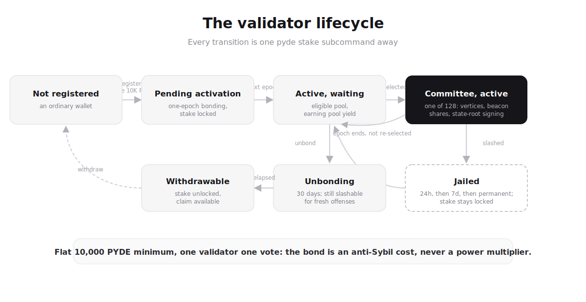

# Validator Operator Guide

This guide is the practical, command-driven side of running a Pyde validator. The companion specs ([`VALIDATOR_LIFECYCLE`](../companion/VALIDATOR_LIFECYCLE.md), [`SLASHING`](../companion/SLASHING.md), [`STATE_SYNC`](../companion/STATE_SYNC.md), [`CHAIN_HALT`](../companion/CHAIN_HALT.md)) cover the formal design; this guide walks you through actually doing it.

The current entry point is the **Soft Testnet Quickstart**: from a clean machine to a validator that's signing, committing, and earning rewards on a multi-validator test network. Pyde is pre-mainnet; mainnet operator docs land closer to launch.

## What a Pyde validator does

Three loops, all running in one `pyde validator` process:

1. **Vertex producer**: every producer tick, when enough peer parents are in the local DAG, build + sign a Mysticeti vertex, insert it into the local DAG, gossip it on `pyde/vertices/1`.
2. **Wave committer**: once the 3-stage rule fires (anchor + supporters at R+1 + certifiers at R+2), assemble a `WaveCommitRecord`, emit a beacon share for the next epoch, emit DKG attestations for the next-epoch ceremony when crossing into a new target epoch, and snapshot the DKG attestation buffer at the last wave of every epoch.
3. **Slashing detectors**: equivocation, downtime, bad anchor attestations, bad state-root signatures, invalid vertex structure, DKG participation failure. Each watches its own evidence channel and submits an on-chain `Slash` tx when it sees something.

The CLI surface for operating it lives under `pyde stake` (register, unbond, claim, unjail, rotate, status), `pyde keys` (FALCON keypair management), and `pyde genesis` (genesis manifest utilities).

## Lifecycle at a glance



*The validator state machine: registration through committee duty, jail, and the 30-day unbonding exit.*

```text
                  pyde keys generate         pyde stake register
unregistered  ────────────────────────▶  EOA  ──────────────────▶  Active
                                                                     │
                                                                     │  pyde stake unbond
                                                                     ▼
                                                                 Unbonding  ───────▶  Exited
                                                                     ▲                  ▲
                                                                     │                  │  pyde stake claim
                                       slash-tx                      │                  │  after UNBONDING_PERIOD_WAVES
                                                                  Jailed
                                                                     │
                                                                     │  pyde stake unjail after jail_until_wave
                                                                     ▼
                                                                  Active
```

Every transition is one `pyde stake <subcommand>` away. The CLI builds the tx, signs it with your FALCON keypair, submits over JSON-RPC, and polls the receipt; no curl scripts needed.

## Next

- [**Soft Testnet Quickstart**](./quickstart.md): the end-to-end path from a clean machine to a committing validator.
